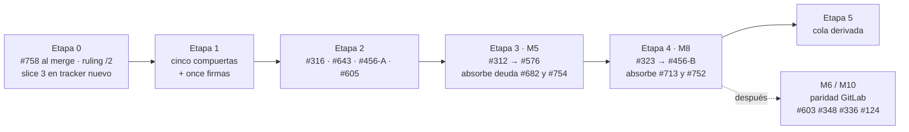

# Del reviewer al router — hoja de ruta M5 → M8

*brain · plan de implementación · **rev 2**, medida la tarde del 20/08/2026 contra
`origin/main @ bb4a58d` y `origin/feature/issue-682 @ 24c506c`.*

Cerrar la cadena de #682, abrir M5 (role-as-port) y M8 (router etapa→engine) sin que
ninguna decisión quede dispersa en tickets que nadie volverá a leer.

**71** issues abiertos · **6** `needs-review` · **5** sin etiqueta de estado · **1** PR
abierto — **#758**, el PR terminal de #682, retenido por el ruling de #743.

> **2026-08-20 (rev 2)** · `main @ bb4a58d`
> Fuente de verdad para la línea M5 → M8. Reemplaza a `AGENT-PRIORITY-HANDOFF.md`,
> `MASTER-PLAN-1.0.md` y `brain-v2-epic-plan.md` para cualquier pregunta de estado o
> prioridad.
>
> **Qué cambió desde la rev 1, el mismo día.** Tres cosas, y las tres tocan la Etapa 0:
> #758 abrió (vencieron tres invariantes de §0), el maintainer firmó **#750**, y el
> **ruling del 20/08 en #743** — *los tiers no definen el sistema de review; el protocolo
> es siempre `brain-review/2`; la mitad de juicio es un toggle con default ON* — cambió
> la premisa sobre la que la cadena de #682 está construida. §4 · Etapa 0 se reescribió
> entera; el resto del plan (Etapas 1 → 5) no se movió.
>
> Issue: [#755](https://github.com/csrinaldi/brain/issues/755)

## 0 · Invariantes de vencimiento

Este archivo está vencido en cuanto alguna de estas deje de valer.

| Invariante | Comando | Valor al escribir |
|---|---|---|
| `origin/main` es `bb4a58d` | `git rev-parse --short origin/main` | `bb4a58d` |
| Hay 71 issues abiertos | `gh issue list --state open --limit 200 --json number --jq length` | `71` |
| #758 sigue abierto | `gh pr view 758 --json state --jq .state` | `OPEN` |
| El tracker todavía tiera el protocolo | `git show origin/feature/issue-682:brain/scripts/vcs/governance-tiers.mjs \| rg -c "reviewProtocol: 'brain-review/1'"` | `2` |
| El ruling de #743 no está en `main` | `git show origin/main:brain/scripts/vcs/governance-tiers.mjs \| rg -c 'inferentialEnabled'` | `0` |
| M5 sigue en cero | `fd -t d '^roles$' brain/` | (sin salida) |

## 1 · Dónde estamos, medido

Cada fila verificada con `gh issue view` hoy; el épico #313 es la fuente, los dos
documentos de `docs/inbox/` del 24/07 son fotos viejas y dicen cosas ya falsas (ver §7).

| M | Nombre | Estado | Evidencia |
|---|---|---|---|
| M0 | Higiene | **HECHO** | #217 #222 #314 cerrados |
| M1 | Gates de merge | **HECHO** | #210 #94 #305 cerrados |
| M2 | Decoupling llega al usuario | **3 de 4** | queda **#316** (unificar los parsers de `.env`) |
| M3 | Reviewer como code-review real | **SALIDA CUMPLIDA** | #405 #408 cerrados; #284 queda como alcance diferido |
| M4 | Distribución y auto-update | **HECHO** | `@logikas/brain@1.1.0` publicado el 18/08; #436 #414 #415 son follow-ups |
| M5 | Role-as-port | **0 %** | `brain/scripts/roles/` no existe; `VALID_OPS = ['init']` |
| M6 | Paridad de provider | **2 de 5** | quedan #124 #131 #129 |
| M7 | Backlog y scope | **2 de 8** | quedan #268 #280 #256 #247 #117 #327 |
| M8 | Router etapa→engine | **0 %** | bloqueado por M5 por diseño |
| M9 | `brain:metrics` | **HECHO** | #324 cerrado (los docs del 24/07 dicen "sin ticket": falso) |
| M10 | Seam contract coverage | **~75 %** | quedan #336 #348 #349 |

### El reviewer (#682), en porcentaje

| Valor | Qué mide |
|---|---|
| **71 %** | por tareas — 15 de 21 en `tasks.md`; el slice 3 está en 0 de 6 |
| **2 / 3** | slices completos — 1 y 2 son lo que #758 lleva |
| **5 / 6** | requisitos cubiertos — REQ-682-5 sigue huérfano |
| **0 %** | en `main` — 44 commits en el tracker, ninguno mergeado |

El maintainer cortó el alcance el 20/08: **#758 lleva los slices 1 y 2 y cierra #750;
#682 queda abierto** y el slice 3 se rediseña sobre un tracker nuevo. Del slice 3 falta
lo mismo de siempre — ADR de transporte (3.1–3.2), runner `same-model` (3.3–3.4), prueba
por el verbo real (3.5), `cross-family` que rechace en vez de degradar (3.6) — más
REQ-682-5 (`convergence.maxRounds` como clave propia), que ningún slice reclama y el
propio `tasks.md` confiesa. Lo que **ya no** aplica de la rev 1 es el paralelo con #713:
el PR terminal existe.

## 2 · Cómo tener la cola de tickets sin mantenerla a mano

El handoff `docs/inbox/AGENT-PRIORITY-HANDOFF.md` declara cuatro invariantes de
expiración. Hoy **tres de cuatro ya vencieron**: `main` no está en `9e9cd36`, no hay 66
issues sino 71, y el paquete no da 404 sino 200. Es la tercera expiración en dos días
hábiles. Un documento que lista prioridades a mano *siempre* va a estar así, porque
nada lo mide.

La cola tiene que **derivarse**, con tres insumos que ya existen en el repo:

1. **La etiqueta es la firma.** `status:approved` la pone un humano (#124). Un ticket
   sin ella no entra en la cola; uno con `needs-review` está esperando tu lectura.
2. **La dependencia se declara, no se narra.** brain ya lee bloques `brain-graph/1` en
   cuerpos de issues (#639, #709, ADR-0032) y `brain:epic:map` los proyecta. Hoy la
   cadena `#456 → #312 → #576 → #323` vive en prosa dentro de tres tickets y dice cosas
   distintas en cada uno. Declararla una sola vez, en el épico, como bloque legible por
   máquina.
3. **La cola es una consulta, no un archivo.** `aprobado ∧ no bloqueado según el grafo
   ∧ sin PR abierto`. Mientras no exista el verbo (#280 `brain:status` y #459 son esa
   línea), la consulta mínima es:

```bash
gh issue list --state open --label status:approved --limit 200 \
  --json number,title,labels,createdAt
```

Higiene previa, barata y necesaria: #745 lleva `status:approved` *y*
`status:needs-review` a la vez; #732 #699 #697 #327 #268 no llevan ninguna. Una cola
derivada de etiquetas sucias hereda la suciedad.

### Los once sin firma

Por ADR-0014 ("no merge without an approved ticket") y #124, un agente no puede
empezar ninguno de estos hasta que vos apliques `status:approved`. Son seis con
`needs-review` (sin contar #745, ya aprobado) y cinco sin etiqueta:

| # | Qué es | Dónde cae en este plan |
|---|---|---|
| #750 | un veredicto puede dar `APPROVE` con evidencia incomputable — vivo en `main` | Etapa 0, primero |
| #752 | el veredicto juzga el eslabón, la cadena es lo que shippea | firma en Etapa 1, se absorbe en M8 · S5 |
| #754 | no existe definición del rol cold-reviewer | firma en Etapa 1, se absorbe en M5 · S5 |
| #746 | un `REVISE` es solo un comentario; cablear `REQUEST_CHANGES` | Etapa 0 (ruling), carril reviewer |
| #734 | `change:archive` reporta una fusión de specs que no hizo | carril SDD, S |
| #732 | cómo renderiza `brain-graph/1` en GitHub — lo mirás vos | tu ojo, cinco minutos |
| #699 | catorce verbos del port VCS descartan la causa | carril VCS, L por verbo |
| #697 | `brain:ship` rechaza 76 de 100 ramas reales | decisión con recomendación escrita |
| #588 | el spec de gobernanza dice "400 líneas" sin tier en seis sitios | carril gobernanza, S |
| #327 | gobernar `docs/inbox/**` | decisión Tier 2 |
| #268 | registro de track-letters — el comentario ya propone issue-number-as-identity | decisión con recomendación escrita |

## 3 · Las compuertas — decisiones que solo vos podés tomar

Cinco decisiones gatillan todo lo demás. Cada una tiene recomendación con su costo, y
ninguna de las cinco está tomada. Una sexta se tomó el 20/08 y va primera, porque es la
que reescribió la Etapa 0.

> **Compuerta 0 · TOMADA el 20/08 — los tiers no definen el sistema de review** (#743)
>
> > *«El protocolo es siempre `brain-review/2`. La mitad de juicio es una capacidad
> > on/off, no una postura de tier. Los tiers responden solo la pregunta de aprobación.»*
>
> Con addendum del mismo día: `reviewer.inferential.enabled` está **ON cuando la llave
> está ausente**; off solo con un `false` explícito.
>
> **Consecuencia, declarada y no escondida:** hasta que el slice 3 cablee el transporte,
> *todo* veredicto de *todo* repo lleva la condición `the judgment half is enabled but no
> transport is configured`. Con `conclusionCauses` (#757) esa condición no puede ablandar
> ni mover un veredicto — es una línea que dice la verdad de este build.
>
> **Qué toca:** nueve puntos del árbol, listados en la Etapa 0 · 0.B; enmienda a ADR-0026
> fila 110 y retiro de REQ-682-2. **Qué deja abierto:** dos preguntas, también en 0.B.

> **Compuerta 1 · El ADR de M8: ¿supersede o enmienda ADR-0019?**
>
> **Tensión real entre doctrina firmada y un ticket.** ADR-0024 (Accepted) dice en sus
> líneas 53–55 que el mapa etapa→engine "requeriría su propio ADR *superseding*
> ADR-0019". El cuerpo de #323 argumenta que alcanza con *enmendar* la primera
> alternativa rechazada, porque "rutear quién PRODUCE y mantener neutral quién
> VERIFICA" no forkea el lifecycle de artefactos — que era la objeción original.
>
> **Recomendación:** enmienda, no supersede — pero son *dos* enmiendas (ADR-0019
> alternativa rechazada nº 1, y ADR-0024 líneas 53–55 que predicen el supersede). Más
> barato que un ADR nuevo y más honesto que ignorar lo que ADR-0024 ya escribió.
> Decidirlo en el `design.md` de M8, como #323 pide explícitamente.

> **Compuerta 2 · Forma de `model_tier` en el port**
>
> Ningún backend declara hoy ninguna capacidad: no hay nada contra qué medir.
> **Recomendación:** tiers abstractos (`cheap | balanced | deep`) en el port de M5; los
> ids concretos de modelo viven solo en el campo opcional `model` del mapa de M8, que
> #323 ya ruleó como pass-through opaco. Los ids cambian cada mes; un contrato no
> debería.

> **Compuerta 3 · Qué backends entran en la paridad n=2**
>
> `plain` y `gentle-ai` viven en el eje `SDD_ENGINE`; `claude` y `antigravity` en el
> eje `AGENT_PLATFORM` (ADR-0024). **Recomendación:** la paridad de M5 se prueba sobre
> los dos del eje engine. Meter los cuatro mezcla ejes que ADR-0024 separó a propósito.

> **Compuerta 4 · Una sola superficie de config, no dos**
>
> #743 propone un verbo `brain:config` que hoy no existe; #323 ruleó un
> `brain:sdd:map` set/get. Son el mismo verbo visto desde dos tickets.
> **Recomendación:** decidir *una* superficie antes de que cualquiera de los dos
> aterrice. Si no, M8 nace con dos formas de tocar `brain.config.json`.
>
> **Actualización del 20/08:** la Compuerta 0 ya definió *una llave*
> (`reviewer.inferential.enabled`) y el criterio 4 de #743 pide un verbo que la escriba.
> Lo que sigue abierto es exactamente eso: **el verbo**, no la llave.

> **Compuerta 5 · Ratificar Q3 (#357) antes de tocar el eje**
>
> "MCP como superficie adicional (A) o reemplazo de `AGENT_PLATFORM` (B)". La
> recomendación ya está escrita en el ticket y B es inimplementable (MCP no tiene
> `PreToolUse`). **Recomendación:** firmar A. Es gratis y deja el eje quieto mientras
> M5 construye sobre él.

Lo que **no** necesita compuerta: el orden de #456. Los tickets parecen contradecirse
(#576 lo pone último, tu comentario en #713 lo pone primero), pero el cuerpo de #456 lo
resuelve: "only closes once #323's map exists". Se modela como dos slices — el
descongelado mecánico arranca en la Etapa 2, el cierre funcional es el último paso de
M8.

## 4 · Las etapas

Secuencia estricta entre etapas; dentro de cada una, lo marcado como agente corre en
paralelo. Cada etapa termina con una condición de salida medible y, donde hay tracker,
con la tarea explícita "abrir el PR terminal" — la lección de #713 y de #682.



### Etapa 0 — Cerrar la cadena del reviewer

**Quién:** agente (código) · humano (dos rulings que quedan) · 3–4 días
**Estado:** en curso. El PR terminal existe — **#758** — y está retenido por decisión
propia del ruling de #743.

Cuatro bloques, en este orden. Solo 0.A y 0.B bloquean el merge.

#### 0.A — Qué falta para mergear #758

Medido contra `origin/feature/issue-682 @ 24c506c`, que es `8ebf523` (la cabeza que la
review en frío leyó) **más un merge de `main`**: no hay un solo cambio de código después
de la review.

| # | Qué | Estado |
|---|---|---|
| 1 | La auditoría del tracker contra el ruling de #743 — el propio ruling dice *«#758 is held until the audit of the tracker against this ruling returns»* | **es el único bloqueo duro**; está hecha abajo, en 0.B |
| 2 | `blocker` de la review rev 1: el body afirmaba que en `standard` no cambia nada, y cambia — todo veredicto lleva una condición nueva | **cerrado** — el body ya declara la condición en `standard` y en `regulated` |
| 3 | `correction`: `IMPLEMENTED_AXES` es una segunda declaración sin pin — agregarle `'same-model'` (mentirle al operador sobre qué ejes existen) pasa la suite completa, 4147/4147 | **falta** — el body lo promete como *chained fix PR* y no hay commit |
| 4 | `editorial`: `governance-tiers.mjs:283` nombra `resolveChallenger()`, símbolo que esta misma cadena dejó de exportar | **falta** — mismo caso |
| 5 | Review en frío del chain **otra vez, sobre la cabeza actual**, con veredicto `brain-review/2` en `APPROVE`. La rev 1 fue `REVISE` sobre `8ebf523` | **falta** |
| 6 | Los gates verdes y la suite | **hecho** — los 6 requeridos por `lite` + `memory-gate` y `phase-order`, verdes en la última corrida; `bootstrap-smoke` y `m4-danger-paths` verdes en la corrida previa; 4147/4147 en tres corridas independientes |
| 7 | Merge limpio contra `main` | **hecho** — `mergeable_state: clean`; intersección de archivos tocados de los dos lados = ∅ |

Es decir: **tres cosas** — los dos hallazgos sin cerrar (3, 4), la review de cierre (5), y
la decisión de 0.B.

#### 0.B — La auditoría contra el ruling de #743, hecha

**Nueve puntos del árbol contradicen el ruling.** Los tres primeros los introdujo esta
misma cadena; los seis siguientes ya viven en `main` y son la deriva que #743 describe.

| # | Dónde | Qué dice hoy | Qué exige el ruling |
|---|---|---|---|
| 1 | `governance-tiers.mjs` · `tierParams()` | `inferentialEnabled` y `challengerAxis` por tier — tarea 1.1 del slice 1 | salen de `tierParams()`; la única llave es `reviewer.inferential.enabled` |
| 2 | `spec.md` · REQ-682-2 | «el productor está OFF en `lite`» cuando la llave está ausente | retirado — ausente significa **ON** (addendum del ruling) |
| 3 | `cli.mjs:511-513` | la compuerta lee el tier, con un comentario que justifica leerlo | lee la config |
| 4 | `tierParams()` | `reviewProtocol: 'brain-review/1'` en `lite` y en `standard` | `brain-review/2` en los tres |
| 5 | `governance-tiers.test.mjs:246` | pinea ese default `/1` (escrito para #391/#394, antes de que #682 existiera) | se retira junto con el default |
| 6 | `resolveReviewProtocol()` | cae al default del tier cuando la llave está ausente | cae a `/2` |
| 7 | ADR-0026, fila 110 | `reviewer verdict mode` tierado: *deterministic / single engine / panel ≥2* | enmienda por Ruta B, promovida por el maintainer |
| 8 | `reviewer-protocol.md` §6 · §6.2 · §13 y `docs/KNOWN-LIMITATIONS.md` | `/1` en `lite`/`standard`, `/2` en `regulated`; «`/2` no es dogfoodable» | una sola forma producida, y la limitación desaparece |
| 9 | `test/fresh-install/` | la promesa «install sin credencial» apoyada en que `lite` está OFF | se vuelve a **medir**: con default ON y sin transporte no hay credencial que pedir — pero eso hay que correrlo, no leerlo |

**Dos preguntas quedan abiertas y son tuyas** — el ruling las deja marcadas:

1. Los bloques `brain-review/1` ya posteados en PRs mergeados: ¿tienen que seguir
   parseando (lectura hacia atrás) o el parser también retira `/1`?
2. ¿El ruling entra **dentro** de #758 o en un PR propio inmediatamente posterior?

> **Recomendación:** parser retro-compatible — lee `/1`, no lo emite nunca — y el ruling
> **fuera** de #758, en un PR chico y propio contra `main`, encolado detrás.
>
> **Por qué:** #758 ya fue revisado en frío como cadena de 44 commits. Meterle un cambio
> de doctrina obliga a rehacer esa review entera en vez de revisar un diff de decenas de
> líneas, y #752 acaba de medir cuánto cuesta revisar cadenas. El argumento en contra es
> real y hay que decirlo: mergeando primero, `main` recibe la deriva del punto 1 (los dos
> parámetros que #743 existe para sacar) y la pierde una tarde después. El costo de
> esperar, en cambio, es que `main` sigue cargando la inversión de §10 de **#750**, que es
> un defecto vivo. Ese es el desempate.

#### 0.C — El slice 3, en un tracker nuevo

Se abre **después** de que el ruling esté aplicado, no antes: el slice 3 lee la llave que
el ruling define.

- ADR de transporte, runner `same-model`, la prueba por el verbo real, y `cross-family`
  rechazando en vez de degradar.
- **REQ-682-5 con tarea propia esta vez** — la fuga que la rev 1 ya había marcado.
- Termina con su propio PR terminal, nombrado en `tasks.md` desde el día uno (#713), y
  con **#682 cerrado**.

#### 0.D — Higiene, en paralelo, sin bloquear nada

- Firmar o rechazar **#745** — hoy lleva `status:approved` **y** `status:needs-review` a
  la vez — y **#746**. **#750 ya está firmado** (20/08). Triaje de #734 y #588 fuera de
  esta línea.
- Limpieza: 17 records `.memory/` sin commitear en el worktree, ~20 worktrees `agent-*`
  de reviews viejas.

**Salida de la Etapa 0:** #758 mergeado con una review en frío del chain en `APPROVE`;
el ruling de #743 vivo en `main` (protocolo `/2` único, mitad de juicio como toggle con
default ON, ADR-0026 enmendado); slice 3 con tracker propio, PR terminal y **#682
cerrado**; 0 commits varados en `feature/issue-682`. #754 y #752 *no* se cierran acá: se
absorben en M5 y M8 (ver §5).

### Etapa 1 — Las cinco compuertas, en una sola sesión

**Quién:** humano · media jornada

- Decidir las compuertas 1–5 de §3 y dejarlas escritas como comentarios de ruling en
  #323, #312, #743 y #357.
- Firmar los `needs-review` que quedaron: #754, #752 (con la nota de en qué etapa se
  absorben).
- Corregir la etiqueta doble de #745 y etiquetar los cinco sin estado.

**Salida:** ningún ticket de M5/M8 tiene un "decide esto antes de escribir código" sin
respuesta.

### Etapa 2 — Prerrequisitos mecánicos, en paralelo

**Quién:** agente · cuatro worktrees independientes · 2–3 días

- **#316** — un solo módulo para resolver `AGENT_PLATFORM / SDD_ENGINE /
  MEMORY_BACKEND`. Es el camino por donde M8 va a leer su mapa; si siguen cinco
  parsers, el mapa se lee cinco veces distinto.
- **#643** — la rama muerta `platformConfig().harness`. Hacerlo *con* el patrón de
  migración aditiva de `config-migrations.mjs`, porque es exactamente el patrón que el
  schema de M8 necesita. Una vez probado, M8 lo reutiliza en vez de inventarlo.
- **#456 slice A** — clave `sdd.stages` en `brain.config.json` con default igual a las
  cuatro de hoy; los **diez** módulos que consumen el stage set a través de `sdd-layout.mjs` (dos de ellos leen la constante directamente) pasan a leerla.
  Comportamiento idéntico, el stage set deja de ser una constante.
- **#605** — el scaffold lee `docs.language`. Toca `new-change.mjs`, que es uno de los
  diez consumidores: después o junto con #456-A, nunca antes.
- Re-medir #312: la medición "n=0 inhabitantes" es del 11/08; antes de diseñar sobre
  ella, confirmar que sigue siendo cierta.

**Salida:** un resolver de ejes, un patrón de migración de schema probado una vez,
stage set como dato con suite idéntica.

### Etapa 3 — M5 — el port de roles (#312), después sus arquetipos (#576)

**Quién:** agente (chained PRs sobre `feature/issue-312`) · humano firma el draft
`adr-0023-sdd-role-port.md` · 1–2 semanas

- **S1** — módulo `brain/scripts/roles/` con el contrato `{action, model_tier, tools,
  reads, writes}`, clave primaria = el artefacto (ruling del 11/08: stage↔artefacto es
  1:1 vía ADR-0019). Inhabitante `plain`.
- **S2** — inhabitante `gentle-ai` y `roles.contract.test.mjs`: paridad n=2 medida, no
  afirmada.
- **S3** — el draft `brain-drafts/adr-0023-sdd-role-port.md` *reescrito desde lo que
  existe* (regla de #599: primero el port, después el ADR), promovido por Ruta A
  dentro del mismo PR que lo cita, indexado en `HOME.md`.
- **S4 — absorber la deuda de #682.** `resolveChallenger` pierde su mitad de binding y
  pasa a ser un caller del port; los consumidores de
  `reviewer.inferential.challenger.*` se actualizan. El `design.md` de #682 ya lo deja
  escrito; acá se vuelve tarea con checkbox.
- **S5 — #576.** Los cuatro arquetipos (Coordinator / Constructor / Adversary /
  Verifier) *sobre* el port, reusando `reads/writes` y sin campos duplicados. El rol
  reviewer proyectado a ≥2 backends byte-determinístico con guard de drift (el
  precedente de `compileAgentsMd`) — **esto cierra #754**. Los tres candados de
  `reviewer-protocol.md` §2 probados tras la mudanza.
- **S6** — PR terminal `feature/issue-312 → main`, como tarea numerada.

**Salida:** `fd -t d '^roles$' brain/` no vacío; paridad n=2 verde; el reviewer de #682
se construye desde el port y no desde su propio config; #754 cerrado.

### Etapa 4 — M8 — el router etapa→engine (#323), y el cierre de #456

**Quién:** agente (chained PRs sobre `feature/issue-323`) · humano firma la(s)
enmienda(s) · 1–2 semanas

- **S1** — la doctrina según la Compuerta 1 (enmiendas a ADR-0019 y ADR-0024, o un
  supersede), promovida dentro del PR que la cita. Sin esto no hay S2.
- **S2** — resolver `stage → engine` + clave `sdd.map` en el schema con migración
  (patrón de #643). Acepta etapas custom *declaradas* en `sdd.stages`, rechaza las no
  declaradas. Campo `model` opcional y opaco.
- **S3** — el verbo de config según la Compuerta 4 (uno solo).
- **S4** — ≥2 engines cableados por etapa (`gentle-ai` + un `plain`/`brain-sdd` real).
  `VALID_OPS` crece en la forma que la doctrina de S1 habilitó, no más.
- **S5 — el guard "que el contrato de artefactos no se forkee".** Acá aterrizan dos
  fugas: la regla de terminación de cadenas de **#713** (`tasks.md` debe nombrar el PR
  terminal — hoy vive como parche descartable en el skill externo), y el header de
  alcance por slice de **#752** (normalización de `tasks.md` que todos los engines
  deben cumplir).
- **S6 — #456 slice B.** Una etapa custom declarada corre de punta a punta. Recién acá
  #456 cierra.
- **S7** — PR terminal `feature/issue-323 → main`.

**Salida:** el owner compone su pipeline eligiendo engine por etapa; la premisa nº 2
del audit sube de "40 / parcial-débil" a un número medido; el parche local de #713 se
borra; #456, #713, #752 cerrados.

### Etapa 5 — La cola viva

**Quién:** agente · opcional, pero es lo que evita volver a este documento

- Declarar el grafo de dependencias del épico como bloque `brain-graph/1`;
  `brain:epic:map` lo proyecta (#704 ya pide que su salida respete `docs.language`).
- Reemplazar el bloque de estado a mano del handoff por uno generado — la línea de
  #280 / #459.

**Salida:** el handoff deja de tener invariantes que vencen: las deriva.

## 5 · Registro de fugas

Cada decisión que hoy vive en un ticket distinto del que la implementa. Si no se
absorbe donde dice la tabla, se construye dos veces.

| Fuga | Dónde vive hoy | Quién la absorbe |
|---|---|---|
| Binding rol→agente→modelo del challenger | `resolve-challenger.mjs` en `feature/issue-682`; deuda escrita en su `design.md` | M5 · S4 |
| Definición del rol cold-reviewer (#754) | No existe; cada lanzamiento reescribe la doctrina | M5 · S5 (arquetipo Adversary) |
| Regla de terminación de cadenas (#713) | Parche descartable en el skill externo Gentle AI | M8 · S5 |
| Header de alcance por slice en `tasks.md` (#752) | Propuesta en el ticket, sin hogar | M8 · S5 |
| Rama muerta `platformConfig.harness` (#643) | `agent-runtime.mjs:206-211` | Etapa 2, con el patrón de migración que M8 reusa |
| Cinco parsers de `.env` (#316) | `harness/cli.mjs:23`, `bootstrap.sh:226` y tres más | Etapa 2, antes de que M8 lea nada |
| Verbo de config duplicado (#743 vs #323) | Dos tickets, dos nombres | Compuerta 4 → M8 · S3 |
| REQ-682-5 sin tarea | `tasks.md` de #682 lo confiesa | Etapa 0 · 0.C |
| Protocolo y mitad de juicio tierados vs. el ruling del 20/08 | `tierParams()`, ADR-0026 fila 110, REQ-682-2 y seis sitios más | Etapa 0 · 0.B |
| Los dos hallazgos abiertos de la review de #758 | prometidos en el body del PR, sin commit | Etapa 0 · 0.A |
| Supersede vs enmienda de ADR-0019 | ADR-0024 dice una cosa, #323 otra | Compuerta 1 → M8 · S1 |
| Campos de #576 que duplican `reads/writes` | Ya ruleado en el ticket (12/08): reusar | M5 · S5 — verificar en review, no re-decidir |

## 6 · Lo que corre al costado

Los otros 55 tickets aprobados no bloquean M5/M8 ni son bloqueados por ellos. Van en
paralelo, por carril, en worktrees propios — con una regla: **ninguno toca
`brain.config.json` schema, `sdd-layout.mjs` ni `harness/` sin pasar por el tracker de
la etapa activa.**

| Carril | n | Tickets | Nota |
|---|---|---|---|
| Gobernanza | 12 | #694 #488 #489 #545 #559 #560 #564 #569 #600 #603 #124 #131 | casi todos S; #545 y #564 necesitan ruling |
| VCS | 7 | #602 #697 #699 #349 #336 #348 #117 | #697 y #117 son decisiones con recomendación escrita |
| i18n | 4 | #638 #642 #715 #716 | medio día; visible para todo adoptante hispanohablante |
| Memoria | 6 | #712 #714 #738 #361 #461 #247 | #461 y #738 piden doctrina |
| Instalación y upgrade | 7 | #659 #658 #647 #632 #436 #415 #414 | #436 y #414 son Tier 2 |
| Reviewer, higiene | 3 | #631 #611 #284 | #284 es alcance diferido de M3 |
| Status y SDD | 10 | #280 #702 #704 #732 #734 #129 #267 #453 #457 #256 | #702 #704 #732 esperan tu ruling o tu ojo |
| Decisiones puras | 4 | #268 #327 #356 #357 | todas con recomendación escrita en el cuerpo |
| Épicos | 2 | #313 #335 | contenedores, no trabajo |

Suma: 55 al costado + 6 de M5/M8 (#312 #576 #323 #456 #316 #643) + 6 de la cadena del
reviewer (#682 #750 #752 #754 #745 #746) + #713 y #743 absorbidos en las etapas = 71.

**El hito que sigue a M8 es la paridad M6 / M10:** #603 (el pipeline GitLab ignora el
tier), #348 (GitLab `branchProtect`: implementar o ratificar), #336 (auditoría de
verbos del port), #124 (la firma es humana, verificada). Va después y no antes porque
M8 cambia la forma en que un engine produce evidencia, y la paridad se mide sobre la
forma final.

## 7 · Lo que este plan da por supuesto, y lo que no verificó

- El orden `#312 → #576 → #323` es el ruleado el 05/08 y el 12/08; este plan lo
  respeta y solo reubica #456 como dos slices porque su propio cuerpo lo pide.
- Las estimaciones de duración son de tamaño relativo, no compromisos: la historia
  reciente (#682: doce blockers en tres rondas) dice que cada slice se revisa en frío
  y se corrige antes del siguiente.
- No se leyó el contenido de `.claude/agents` externos ni el skill package de Gentle AI
  donde vive el parche de #713; se asume que es descartable como dice tu comentario.
- La rev 2 midió el tracker en `24c506c` y `main` en `bb4a58d`. No re-corrió la suite
  ni los nueve gates: toma como buenos los 4147/4147 y los 8/8 checks verdes que la
  review en frío de #758 dejó publicados el mismo día.
- Los tres documentos de `docs/inbox/` tienen afirmaciones vencidas: #435 abierto
  (cerrado, publicado), #723 "recién firmado" (mergeado), M9 "sin ticket" (#324,
  cerrado), #631 sin firma (firmado). No usarlos para responder estado.

## 8 · Cruce con el plan v1.1 del otro agente

Un segundo agente produjo el mismo día un "Plan de Saneamiento v1.1" con el mismo
esqueleto: #682 → M5 → M8, paridad n=2 sobre `plain` + `gentle-ai`, #754 como puente a
M5, guard anti-fork. Esta versión incorpora lo que sumaba y deja registrado lo que no.

| Del otro plan | Decisión | Por qué |
|---|---|---|
| Lista nominal de los once sin firma, con ADR-0014 | **TOMADO** | §2 — cuenta bien (6 + 5) y la cita es correcta |
| Diagrama de dependencias entre etapas | **TOMADO** | §4 — con las absorciones marcadas y M6/M10 como siguiente hito |
| Validar los 9 gates en el PR terminal | **TOMADO** | Salida de la Etapa 0. La suite quedó en 4147 al abrir #758, no en 4129 |
| Totales por área y paridad M6/M10 como bloque posterior | **TOMADO** | §6 |
| Reviewer "~90%", Etapa 0 = abrir el PR terminal ya | **RECHAZADO** | Medido 71%; el slice 3 (transporte) está en cero y #750 vive en `main`. Mergear ahora shippea "la mitad del juicio", que #682 prohíbe por título |
| #743 y #713 en una Etapa 3 posterior a M8 | **RECHAZADO** | Son las dos duplicaciones que M8 existe para absorber; #713 "como detección en gates" es el remedio que tu propio comentario descartó |
| Arquetipos `architect / coder / reviewer` | **RECHAZADO** | #576 define Coordinator / Constructor / Adversary / Verifier |
| "Promover el draft `adr-0023-sdd-role-port.md`" como ratificación del draft | **RECHAZADO** | #599 ruleó: primero el port, después el ADR desde lo que existe |
| Supersede de ADR-0019 como hecho | **COMPUERTA** | ADR-0024 lo predice, #323 lo discute; es tuyo (Compuerta 1) |
| Firmas al final (Etapa 3) | **RECHAZADO** | Firmar es gratis y desbloquea; va en la Etapa 1 |
