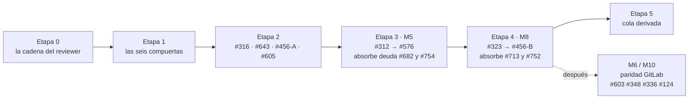

# Del reviewer al router — hoja de ruta M5 → M8

*brain · el ARGUMENTO de la secuencia M5 → M8. No es un tablero de estado.*

> ## Este archivo no dice en qué estado está nada
>
> **El estado se lee de los tickets.** Fue la única fuente que estuvo bien las cuatro
> veces que este documento se equivocó, y por un motivo estructural: un issue lo
> actualiza un humano como DECISIÓN, no como foto que alguien tiene que acordarse
> de refrescar.
>
> ```
> npm run brain:status -- --issue <N> [--pr <N>] [--change <dir>]     (#280)
> gh issue list --state open --label status:approved --limit 200
> ```
>
> **Qué SÍ vive acá, y no caduca:** por qué M5 va antes que M8, por qué #456 se
> parte en dos, qué fuga absorbe qué etapa, y el razonamiento con el que se
> tomó cada compuerta. Nada de eso cambió una sola vez en nueve días.
>
> **Qué se sacó, y por qué** (#798): la tabla de hitos con porcentajes, los
> estados de los tickets, el conteo de issues abiertos y los marcadores de
> compuerta tomada. Ese material se revisó a mano cuatro veces en nueve días —
> revs 4 → 7 — y caducó siempre, mientras el argumento no falló nunca. El §2 de
> este mismo archivo lo había diagnosticado el 21/08.
>
> **Los rulings de las seis compuertas viven en sus issues** — #792 (C1), #312
> (C2 y C3), #323 (C4), #357 (C5), #773 (C6) — y no se copian acá. Copiarlos de
> vuelta es exactamente cómo este archivo volvería a tener estado.

## 0 · Cómo saber si este documento sigue describiendo el mismo problema

No lleva invariantes de fecha ni de sha: ésos son los que caducaban. Lleva los
dos hechos estructurales de los que depende TODA su secuencia. Si alguno deja de
valer, lo que hay que revisar es el argumento, no una tabla.

| el argumento asume | cómo verificarlo |
|---|---|
| M5 todavía no existe, así que M8 no puede apoyarse en él | `ls -d brain/scripts/roles` |
| las cuatro etapas del ciclo SDD siguen sin poder rutearse | `assertRoutableStage` en `brain/scripts/lib/stage-engine.mjs` refusa `SDD_LIFECYCLE_STAGES` |

El segundo es el que la Compuerta 1 habilitó a levantar **bajo cuatro
condiciones** (ADR-0019 Amendment 1). El día que se levante, la Etapa 4 de este
plan deja de describir trabajo pendiente y pasa a ser historia.

## 1 · Dónde estamos

En los tickets. Ver la cabecera.

Este archivo tenía acá una tabla de hitos con porcentajes y una lista de tickets
sin firma. Las dos caducaron en días, dos veces cada una. Lo que sobrevive de esa
sección es una sola observación, y es del §2: **la cola tiene que derivarse.**


## 2 · Cómo tener la cola de tickets sin mantenerla a mano

El handoff `docs/inbox/AGENT-PRIORITY-HANDOFF.md` declara cuatro invariantes de
expiración. Hoy **tres de cuatro ya vencieron**: `main` no está en `9e9cd36`, no hay 66
issues sino **78** (medidos por el port el 27/08), y el paquete no da 404 sino 200. Es la tercera expiración en dos días
hábiles. Un documento que lista prioridades a mano *siempre* va a estar así, porque
nada lo mide.

La cola tiene que **derivarse**, con tres insumos que ya existen en el repo:

1. **La etiqueta es la firma.** `status:approved` la pone un humano (#124). Un ticket
   sin ella no entra en la cola; uno con `needs-review` está esperando tu lectura.
2. **La dependencia se declara, no se narra.** brain ya lee bloques `brain-graph/1` en
   cuerpos de issues (#639, #709, ADR-0032) y `brain:epic:map` los proyecta. Hoy la
   cadena `#456 → #312 → #576 → #323` vive en prosa dentro de tres tickets y dice cosas
   distintas en cada uno. Declararla una sola vez, en el épico, como bloque legible por
   máquina.
3. **La cola es una consulta, no un archivo.** `aprobado ∧ no bloqueado según el grafo
   ∧ sin PR abierto`. Los dos verbos de esa línea existen: **#459** (`brain:epic:map`)
   y **#280** (`brain:status`), que además reporta la DIVERGENCIA entre lo que dice el
   ticket y lo que hay en disco — que es el defecto que este documento encarnó cuatro
   veces. Para la cola completa, la consulta mínima sigue siendo:

```bash
gh issue list --state open --label status:approved --limit 200 \
  --json number,title,labels,createdAt
```

Higiene previa, barata y necesaria: #745 lleva `status:approved` *y*
`status:needs-review` a la vez; #732 #699 #697 #327 #268 no llevan ninguna. Una cola
derivada de etiquetas sucias hereda la suciedad.

## 3 · Las compuertas — decisiones que solo vos podés tomar

**Seis** decisiones gatillan todo lo demás. Cada una tiene recomendación con su costo,
y cada una lleva abajo **su razonamiento y su costo**. Cuál está tomada y cuál no
se lee en su issue — #792 (C1), #312 (C2, C3), #323 (C4), #357 (C5), #773 (C6) —
porque el ruling firmado vive ahí y una copia acá sería una segunda declaración
que puede derivar de la primera.
Una séptima —la Compuerta 0— se tomó el 20/08 y va primera, porque es la que reescribió
la Etapa 0.

> **Compuerta 0 · el protocolo y la mitad de juicio** (#743)
>
> > *«El protocolo es siempre `brain-review/2`. La mitad de juicio es una capacidad
> > on/off, no una postura de tier. Los tiers responden solo la pregunta de aprobación.»*
>
> Con addendum del mismo día: `reviewer.inferential.enabled` está **ON cuando la llave
> está ausente**; off solo con un `false` explícito.
>
> **Consecuencia, declarada y no escondida:** hasta que el slice 3 cablee el transporte,
> *todo* veredicto de *todo* repo lleva la condición `the judgment half is enabled but no
> transport is configured`. Con `conclusionCauses` (#757) esa condición no puede ablandar
> ni mover un veredicto — es una línea que dice la verdad de este build.
>
> **Qué toca:** nueve puntos del árbol, listados en la Etapa 0 · 0.B; enmienda a ADR-0026
> fila 110 y retiro de REQ-682-2. **Qué deja abierto:** dos preguntas, también en 0.B.

> **Compuerta 1 · El ADR de M8: ¿supersede o enmienda ADR-0019?**
>
> **Tensión real entre doctrina firmada y un ticket.** ADR-0024 (Accepted) dice en sus
> líneas 53–55 que el mapa etapa→engine "requeriría su propio ADR *superseding*
> ADR-0019". El cuerpo de #323 argumenta que alcanza con *enmendar* la primera
> alternativa rechazada, porque "rutear quién PRODUCE y mantener neutral quién
> VERIFICA" no forkea el lifecycle de artefactos — que era la objeción original.
>
> **Recomendación:** enmienda, no supersede — pero son *dos* enmiendas (ADR-0019
> alternativa rechazada nº 1, y ADR-0024 líneas 53–55 que predicen el supersede). Más
> barato que un ADR nuevo y más honesto que ignorar lo que ADR-0024 ya escribió.
> Decidirlo en el `design.md` de M8, como #323 pide explícitamente.

> **Compuerta 2 · Forma de `model_tier` en el port**
>
> Ningún backend declara hoy ninguna capacidad: no hay nada contra qué medir.
> **Recomendación:** tiers abstractos (`cheap | balanced | deep`) en el port de M5; los
> ids concretos de modelo viven solo en el campo opcional `model` del mapa de M8, que
> #323 ya ruleó como pass-through opaco. Los ids cambian cada mes; un contrato no
> debería.

> **Compuerta 3 · Qué backends entran en la paridad n=2**
>
> `plain` y `gentle-ai` viven en el eje `SDD_ENGINE`; `claude` y `antigravity` en el
> eje `AGENT_PLATFORM` (ADR-0024). **Recomendación:** la paridad de M5 se prueba sobre
> los dos del eje engine. Meter los cuatro mezcla ejes que ADR-0024 separó a propósito.

> **Compuerta 4 · Una sola superficie de config, no dos**
>
> #743 propone un verbo `brain:config` que hoy no existe; #323 ruleó un
> `brain:sdd:map` set/get. Son el mismo verbo visto desde dos tickets.
> **Recomendación:** decidir *una* superficie antes de que cualquiera de los dos
> aterrice. Si no, M8 nace con dos formas de tocar `brain.config.json`.
>
> **Actualización del 20/08:** la Compuerta 0 ya definió *una llave*
> (`reviewer.inferential.enabled`) y el criterio 4 de #743 pide un verbo que la escriba.
> Lo que sigue abierto es exactamente eso: **el verbo**, no la llave.

> **Compuerta 5 · Ratificar Q3 (#357) antes de tocar el eje**
>
> "MCP como superficie adicional (A) o reemplazo de `AGENT_PLATFORM` (B)". La
> recomendación ya está escrita en el ticket y B es inimplementable (MCP no tiene
> `PreToolUse`). **Recomendación:** firmar A. Es gratis y deja el eje quieto mientras
> M5 construye sobre él.

> **Compuerta 6 · ¿`BRAIN_REVIEWER_TOKEN` se vuelve file-readable? (#773)**
>
> **No estaba en la rev 5 y es la más urgente de las seis**, por una asimetría de
> tiempos: **#316 ya lleva `status:approved` y puede arrancar mañana; #773 no está
> firmado.**
>
> Hoy el árbol lee el entorno en **dos direcciones opuestas**: `review/identity.mjs:144`
> lee `process.env` y nada más, mientras todo verbo del port lee `.env` primero. Por eso
> `VCS_TOKEN` puede vivir en `.env` y `BRAIN_REVIEWER_TOKEN` tiene que exportarse a mano
> en cada terminal. Unificar esos lectores **es** #316; el documento de #774 mide la
> asimetría con file:line.
>
> **Y ahí está la trampa.** El paso 1 se parte en dos y el corte es la decisión:
>
> - **1a — un solo lector, una sola precedencia, el token del reviewer sigue siendo
>   sólo de shell.** Es implementación pura. No mueve ningún warrant. Es #316 y nada más.
> - **1b — el token del reviewer pasa a leerse de archivo.** Es lo que entrega «el
>   desarrollador no configura nada», y **saca a la credencial del poster de la única
>   fila `by construction`** de la tabla de warrants de ADR-0033: el kernel impone el
>   scrub del entorno, y un archivo en disco no es una variable de entorno. Eso es una
>   **enmienda a ADR-0033**, no un refactor.
>
> **Recomendación:** firmar el corte —**1a sí, 1b no**— *antes* de que #316 arranque, y
> dejarlo escrito como comentario de ruling en #316 además de en #773. Si no, 1b entra
> de contrabando dentro del refactor de parsers y **el diff parece plumbing**: nadie ve
> en review que se removió la fila más fuerte de la tabla.
>
> **Lo que esta compuerta NO decide:** #772. Detectar un productor que *cambió* el árbol
> y decidir si un productor puede *leer* una credencial son cosas distintas — una lectura
> no deja rastro en `git status`. Construir #772 no desbloquea #773 en una línea.

Lo que **no** necesita compuerta: el orden de #456. Los tickets parecen contradecirse
(#576 lo pone último, tu comentario en #713 lo pone primero), pero el cuerpo de #456 lo
resuelve: "only closes once #323's map exists". Se modela como dos slices — el
descongelado mecánico arranca en la Etapa 2, el cierre funcional es el último paso de
M8.

## 4 · Las etapas

Secuencia estricta entre etapas; dentro de cada una, lo marcado como agente corre en
paralelo. Cada etapa termina con una condición de salida medible y, donde hay tracker,
con la tarea explícita "abrir el PR terminal" — la lección de #713 y de #682.



### Etapas 0 y 1 — cumplidas, y por eso ya no se describen acá

La Etapa 0 cerró la cadena del reviewer (#682) y la Etapa 1 tomó las seis
compuertas. Ciento cincuenta líneas de plan de ejecución vivían acá y hoy
describen trabajo hecho, que es la forma más cara de estado: se lee como
pendiente.

Lo que de esas dos etapas no caduca está en otro lado y con más autoridad —
**ADR-0033** y sus dos enmiendas para la cadena del reviewer, y los rulings de
las seis compuertas en sus issues. El §5 de este archivo conserva las fugas que
esas etapas dejaron abiertas.


### Etapa 2 — Prerrequisitos mecánicos, en paralelo

**Quién:** agente · cuatro worktrees independientes · 2–3 días

- **#316** — un solo módulo para resolver `AGENT_PLATFORM / SDD_ENGINE /
  MEMORY_BACKEND`. Es el camino por donde M8 va a leer su mapa; si siguen cinco
  parsers, el mapa se lee cinco veces distinto.
  **Gatillado por la Compuerta 6** (ADR-0033 Amendment 1). El asimétrico está medido en
  #774: `review/identity.mjs:144` lee `process.env` y todo verbo del port lee `.env`
  primero. Unificar esos lectores es exactamente este ticket — y hacerlo **sin** volver
  file-readable a `BRAIN_REVIEWER_TOKEN` es el paso 1a. El 1b es una enmienda a ADR-0033
  y **no entra acá**.
- **#643** — la rama muerta `platformConfig().harness`. Hacerlo *con* el patrón de
  migración aditiva de `config-migrations.mjs`, porque es exactamente el patrón que el
  schema de M8 necesita. Una vez probado, M8 lo reutiliza en vez de inventarlo.
- **#456 slice A** — clave `sdd.stages` en `brain.config.json` con default igual a las
  cuatro de hoy; los **diez** módulos que consumen el stage set a través de `sdd-layout.mjs` (dos de ellos leen la constante directamente) pasan a leerla.
  Comportamiento idéntico, el stage set deja de ser una constante.
- **#605** — el scaffold lee `docs.language`. Toca `new-change.mjs`, que es uno de los
  diez consumidores: después o junto con #456-A, nunca antes.
- Re-medir #312: la medición "n=0 inhabitantes" es del 11/08; antes de diseñar sobre
  ella, confirmar que sigue siendo cierta.

**Salida:** un resolver de ejes, un patrón de migración de schema probado una vez,
stage set como dato con suite idéntica.

### Etapa 3 — M5 — el port de roles (#312), después sus arquetipos (#576)

**Quién:** agente (chained PRs sobre `feature/issue-312`) · humano firma el draft
`adr-0023-sdd-role-port.md` · 1–2 semanas

- **S1** — módulo `brain/scripts/roles/` con el contrato `{action, model_tier, tools,
  reads, writes}`, clave primaria = el artefacto (ruling del 11/08: stage↔artefacto es
  1:1 vía ADR-0019). Inhabitante `plain`.
- **S2** — inhabitante `gentle-ai` y `roles.contract.test.mjs`: paridad n=2 medida, no
  afirmada.
- **S3** — el draft `brain-drafts/adr-0023-sdd-role-port.md` *reescrito desde lo que
  existe* (regla de #599: primero el port, después el ADR), promovido por Ruta A
  dentro del mismo PR que lo cita, indexado en `HOME.md`.
- **S4 — absorber la deuda de #682.** `resolveChallenger` pierde su mitad de binding y
  pasa a ser un caller del port; los consumidores de
  `reviewer.inferential.challenger.*` se actualizan. El `design.md` de #682 ya lo deja
  escrito; acá se vuelve tarea con checkbox.
- **S5 — #576.** Los cuatro arquetipos (Coordinator / Constructor / Adversary /
  Verifier) *sobre* el port, reusando `reads/writes` y sin campos duplicados. El rol
  reviewer proyectado a ≥2 backends byte-determinístico con guard de drift (el
  precedente de `compileAgentsMd`) — **esto cierra #754**. Los tres candados de
  `reviewer-protocol.md` §2 probados tras la mudanza.
- **S6** — PR terminal `feature/issue-312 → main`, como tarea numerada.

**Salida:** `fd -t d '^roles$' brain/` no vacío; paridad n=2 verde; el reviewer de #682
se construye desde el port y no desde su propio config; #754 cerrado.

### Etapa 4 — M8 — el router etapa→engine (#323), y el cierre de #456

**Quién:** agente (chained PRs sobre `feature/issue-323`) · humano firma la(s)
enmienda(s) · 1–2 semanas

- **S1** — la doctrina según la Compuerta 1 (enmiendas a ADR-0019 y ADR-0024, o un
  supersede), promovida dentro del PR que la cita. Sin esto no hay S2.
- **S2** — resolver `stage → engine` + clave `sdd.map` en el schema con migración
  (patrón de #643). Acepta etapas custom *declaradas* en `sdd.stages`, rechaza las no
  declaradas. Campo `model` opcional y opaco.
- **S3** — el verbo de config según la Compuerta 4 (uno solo).
- **S4** — ≥2 engines cableados por etapa (`gentle-ai` + un `plain`/`brain-sdd` real).
  `VALID_OPS` crece en la forma que la doctrina de S1 habilitó, no más.
- **S5 — el guard "que el contrato de artefactos no se forkee".** Acá aterrizan dos
  fugas: la regla de terminación de cadenas de **#713** (`tasks.md` debe nombrar el PR
  terminal — hoy vive como parche descartable en el skill externo), y el header de
  alcance por slice de **#752** (normalización de `tasks.md` que todos los engines
  deben cumplir).
- **S6 — #456 slice B.** Una etapa custom declarada corre de punta a punta. Recién acá
  #456 cierra.
- **S7** — PR terminal `feature/issue-323 → main`.

**Salida:** el owner compone su pipeline eligiendo engine por etapa; la premisa nº 2
del audit sube de "40 / parcial-débil" a un número medido; el parche local de #713 se
borra; #456, #713, #752 cerrados.

### Etapa 5 — La cola viva

**Quién:** agente · opcional, pero es lo que evita volver a este documento

- Declarar el grafo de dependencias del épico como bloque `brain-graph/1`;
  `brain:epic:map` lo proyecta (#704 ya pide que su salida respete `docs.language`).
- Reemplazar el bloque de estado a mano del handoff por uno generado — la línea de
  #280 / #459.

**Salida:** el handoff deja de tener invariantes que vencen: las deriva.

## 5 · Registro de fugas

Cada decisión que hoy vive en un ticket distinto del que la implementa. Si no se
absorbe donde dice la tabla, se construye dos veces.

| Fuga | Dónde vive hoy | Quién la absorbe |
|---|---|---|
| Binding rol→agente→modelo del challenger | `resolve-challenger.mjs` en `feature/issue-682`; deuda escrita en su `design.md` | M5 · S4 |
| Definición del rol cold-reviewer (#754) | No existe; cada lanzamiento reescribe la doctrina | M5 · S5 (arquetipo Adversary) |
| Regla de terminación de cadenas (#713) | Parche descartable en el skill externo Gentle AI | M8 · S5 |
| Header de alcance por slice en `tasks.md` (#752) | Propuesta en el ticket, sin hogar | M8 · S5 |
| Rama muerta `platformConfig.harness` (#643) | `agent-runtime.mjs:206-211` | Etapa 2, con el patrón de migración que M8 reusa |
| Cinco parsers de `.env` (#316) | `harness/cli.mjs:23`, `bootstrap.sh:226` y tres más | Etapa 2, antes de que M8 lea nada |
| **Dos lectores de entorno opuestos** (#774 · Gap A) | `review/identity.mjs:144` lee `process.env`; todo verbo del port lee `.env` primero | **#316**, Etapa 2 — con el ruling de la Compuerta 6 escrito antes |
| **El warrant `by construction` de ADR-0033** (#773) | la tabla de warrants del ADR; **nadie lo custodia dentro del diff de #316** | **Compuerta 6**, Etapa 1 |
| **El chequeo post-run del árbol, sólo como test** (#772) | `review/lib/run-cold-review-stage.mjs:32-35` | carril reviewer-higiene — **no** desbloquea #773 |
| **La convención de worktree-por-issue, sin lector** (#782) | `harness-contract.md:28` la declara canónica y `ticket-start.mjs:29` defaultea a lo contrario | sin hogar — misma familia que #759 y #772 |
| Verbo de config duplicado (#743 vs #323) | Dos tickets, dos nombres | Compuerta 4 → M8 · S3 |
| REQ-682-5 sin tarea | `tasks.md` de #682 lo confiesa | Etapa 0 · 0.C |
| Tres criterios de #743 sin cerrar (#761) | filas borderline, superficie de capacidad, ¿sobrevive `regulated`? | firma en Etapa 1; la superficie se cruza con la Compuerta 4 |
| Un hallazgo que el veredicto no puede llevar (#760) | §6.2 tipa `follow_ups[]` a `pre-existing\|base-only`; `findings[]` lo escribe solo el verbo (§13) | decisión propia — es doctrina, va con #745 y #752 |
| Constante declarada sin lector, 5ª instancia (#759) | `RECOGNISED_OUTCOMES` en `refuter.mjs`; su única consumidora es un mensaje | slice 3 edita esa misma constante — 0.C |
| Supersede vs enmienda de ADR-0019 | ADR-0024 dice una cosa, #323 otra | Compuerta 1 → M8 · S1 |
| Campos de #576 que duplican `reads/writes` | Ya ruleado en el ticket (12/08): reusar | M5 · S5 — verificar en review, no re-decidir |

## 6 · Lo que corre al costado

Los otros 55 tickets aprobados no bloquean M5/M8 ni son bloqueados por ellos. Van en
paralelo, por carril, en worktrees propios — con una regla: **ninguno toca
`brain.config.json` schema, `sdd-layout.mjs` ni `harness/` sin pasar por el tracker de
la etapa activa.**

| Carril | n | Tickets | Nota |
|---|---|---|---|
| Gobernanza | 12 | #694 #488 #489 #545 #559 #560 #564 #569 #600 #603 #124 #131 | casi todos S; #545 y #564 necesitan ruling |
| VCS | 7 | #602 #697 #699 #349 #336 #348 #117 | #697 y #117 son decisiones con recomendación escrita |
| i18n | 4 | #638 #642 #715 #716 | medio día; visible para todo adoptante hispanohablante |
| Memoria | 6 | #712 #714 #738 #361 #461 #247 | #461 y #738 piden doctrina |
| Instalación y upgrade | 7 | #659 #658 #647 #632 #436 #415 #414 | #436 y #414 son Tier 2 |
| Reviewer, higiene | 6 | #631 #611 #284 #759 #760 #772 | #284 es alcance diferido de M3; #759 y #760 salieron de las rondas de review de #758; **#772** salió de las de #765 |
| Status y SDD | 10 | #280 #702 #704 #732 #734 #129 #267 #453 #457 #256 | #702 #704 #732 esperan tu ruling o tu ojo |
| Decisiones puras | 4 | #268 #327 #356 #357 | todas con recomendación escrita en el cuerpo |
| Épicos | 2 | #313 #335 | contenedores, no trabajo |

Los carriles de arriba son la FORMA del backlog, no su tamaño: qué familias de
trabajo corren al costado sin bloquear M5/M8 ni ser bloqueadas por ellas. Cuántos
tickets tiene cada uno hoy se cuenta con la consulta del §2, no acá — el conteo
fue lo primero que caducó en cada rev.

**El hito que sigue a M8 es la paridad M6 / M10:** #603 (el pipeline GitLab ignora el
tier), #348 (GitLab `branchProtect`: implementar o ratificar), #336 (auditoría de
verbos del port), #124 (la firma es humana, verificada). Va después y no antes porque
M8 cambia la forma en que un engine produce evidencia, y la paridad se mide sobre la
forma final.

## 7 · Lo que este plan da por supuesto, y lo que no verificó

- El orden `#312 → #576 → #323` es el ruleado el 05/08 y el 12/08; este plan lo
  respeta y solo reubica #456 como dos slices porque su propio cuerpo lo pide.
- Las estimaciones de duración son de tamaño relativo, no compromisos: la historia
  reciente (#682: doce blockers en tres rondas) dice que cada slice se revisa en frío
  y se corrige antes del siguiente.
- No se leyó el contenido de `.claude/agents` externos ni el skill package de Gentle AI
  donde vive el parche de #713; se asume que es descartable como dice tu comentario.
- La rev 2 midió el tracker en `24c506c` y `main` en `bb4a58d`. No re-corrió la suite
  ni los nueve gates: toma como buenos los 4147/4147 y los 8/8 checks verdes que la
  review en frío de #758 dejó publicados el mismo día.
- Los tres documentos de `docs/inbox/` tienen afirmaciones vencidas: #435 abierto
  (cerrado, publicado), #723 "recién firmado" (mergeado), M9 "sin ticket" (#324,
  cerrado), #631 sin firma (firmado). No usarlos para responder estado.
- **La rev 6 no pudo verificar si las compuertas 1–5 ya tienen ruling escrito.** El port
  VCS tiene `issueComment` para *escribir* y ningún verbo para *leer* comentarios
  (`vcs/cli.mjs` · `VERBS`), y `gh` corre deslogueado en esta máquina por el modelo de
  credenciales del reviewer. Las seis se listan como no tomadas porque **el trabajo que
  desbloquean no arrancó** — `brain/scripts/roles/` no existe —, no porque se haya leído
  cada hilo. Si firmaste alguna en un comentario, decilo y se tacha.
- Los estados y etiquetas de §1, §2 y §5 **sí** se midieron por el port el 27/08, uno por
  uno.

## 8 · Cruce con el plan v1.1 del otro agente

Un segundo agente produjo el mismo día un "Plan de Saneamiento v1.1" con el mismo
esqueleto: #682 → M5 → M8, paridad n=2 sobre `plain` + `gentle-ai`, #754 como puente a
M5, guard anti-fork. Esta versión incorpora lo que sumaba y deja registrado lo que no.

*Esta tabla es una foto de la rev 5 y se deja como historia: sus cifras («once sin
firma», «medido 71%») eran ciertas el 21/08 y la rev 6 las actualizó en §1 y §2. Lo que
no cambia son las decisiones — se registran, no se re-toman.*

| Del otro plan | Decisión | Por qué |
|---|---|---|
| Lista nominal de los once sin firma, con ADR-0014 | **TOMADO** | §2 — cuenta bien (6 + 5) y la cita es correcta |
| Diagrama de dependencias entre etapas | **TOMADO** | §4 — con las absorciones marcadas y M6/M10 como siguiente hito |
| Validar los 9 gates en el PR terminal | **TOMADO** | Salida de la Etapa 0. La suite quedó en 4147 al abrir #758, no en 4129 |
| Totales por área y paridad M6/M10 como bloque posterior | **TOMADO** | §6 |
| Reviewer "~90%", Etapa 0 = abrir el PR terminal ya | **RECHAZADO** | Medido 71%; el slice 3 (transporte) está en cero y #750 vive en `main`. Mergear ahora shippea "la mitad del juicio", que #682 prohíbe por título |
| #743 y #713 en una Etapa 3 posterior a M8 | **RECHAZADO** | Son las dos duplicaciones que M8 existe para absorber; #713 "como detección en gates" es el remedio que tu propio comentario descartó |
| Arquetipos `architect / coder / reviewer` | **RECHAZADO** | #576 define Coordinator / Constructor / Adversary / Verifier |
| "Promover el draft `adr-0023-sdd-role-port.md`" como ratificación del draft | **RECHAZADO** | #599 ruleó: primero el port, después el ADR desde lo que existe |
| Supersede de ADR-0019 como hecho | **COMPUERTA** | ADR-0024 lo predice, #323 lo discute; es tuyo (Compuerta 1) |
| Firmas al final (Etapa 3) | **RECHAZADO** | Firmar es gratis y desbloquea; va en la Etapa 1 |
