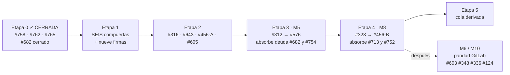

# Del reviewer al router — hoja de ruta M5 → M8

*brain · plan de implementación · **rev 6**, medida el 27/08/2026 contra
`origin/main @ dd31906`.*

Cerrar la cadena de #682, abrir M5 (role-as-port) y M8 (router etapa→engine) sin que
ninguna decisión quede dispersa en tickets que nadie volverá a leer.

**La Etapa 0 está CERRADA.** #765 mergeó, #682 y #750 están cerrados, y ADR-0033 vive
en `brain/project/decisions/`. La etapa activa es la **Etapa 1 — las compuertas**, y
ahora son **seis**, no cinco.

> **2026-08-27 (rev 6)** · `main @ dd31906`
> Fuente de verdad para la línea M5 → M8. Reemplaza a `AGENT-PRIORITY-HANDOFF.md`,
> `MASTER-PLAN-1.0.md` y `brain-v2-epic-plan.md` para cualquier pregunta de estado o
> prioridad.
>
> **Qué cambió desde la rev 5 — la Etapa 0 se cerró.** #765 mergeó a `main` y con él el
> slice 3 entero: **#682 está `closed/completed`**, igual que #750 y #743. Las dos piezas
> que la rev 5 midió como faltantes existen las dos — `makeArtifactGenerate` aparece tres
> veces en `review/cli.mjs` sobre `origin/main`, y el cargador que faltaba es
> `cli.mjs:256-257`. **ADR-0033 dejó de ser un draft:** vive en
> `brain/project/decisions/adr-0033-cold-review-transport.md`, indexado en `HOME.md:82`,
> así que ya se cita como `ADR-0033` y no por nombre de archivo. En `tasks.md` del slice 3
> queda **una sola casilla sin marcar, C.6**, y está a medias por un motivo que importa:
> cerraba #682 *y* #754, y #754 sigue abierto.
>
> **Lo segundo que cambió es la firma.** La lista «los once sin firma» de la rev 5 se
> vació casi entera: #752 #746 #759 #760 #761 #734 #732 llevan hoy `status:approved`.
> Quedan **cuatro sin ninguna etiqueta de estado** (#699 #697 #327 #268), **uno en
> `needs-review`** (#588), y **#754 con la etiqueta doble** — `status:approved` *y*
> `status:needs-review` a la vez, que es exactamente el defecto que la rev 5 le anotaba
> a #745.
>
> **Y apareció una compuerta que la rev 5 no tenía.** Tres issues del 26/08 —#772 #773
> #774— escriben por primera vez el modelo de credenciales, y **#773 es doctrina, no
> implementación**: si `BRAIN_REVIEWER_TOKEN` se vuelve file-readable, la credencial del
> poster sale de la **única fila `by construction`** de la tabla de warrants de ADR-0033.
> Es la **Compuerta 6** del §3, y su relación con la Etapa 2 es asimétrica: **#316 ya está
> aprobado y puede arrancar mañana; #773 no está firmado.** Un agente que tome #316 de
> buena fe no tiene cómo saber que no debe tocar eso, y el diff parecería plumbing.
>
> §1, §3, §4 · Etapa 0 y §5 se actualizaron. Las Etapas 1 → 5 no cambiaron de contenido,
> solo de punto de entrada.
>
> Issue: [#755](https://github.com/csrinaldi/brain/issues/755)

> **2026-08-21 (rev 5)** · `main @ 005dc35`
>
> **Qué cambió desde la rev 4.** El **slice A de 0.C está completo** y B.1–B.3
> aterrizaron. La mitad de juicio corre de punta a punta y un hallazgo razonado llega
> **como comentario en la línea cambiada** de un PR — el criterio de salida de M3,
> alcanzado, y alcanzado **sin spawnear nada**: el engine del stage es un archivo.
>
> Y una medición que ordenó todo el slice: **la mitad «visible en el PR» ya estaba
> construida**. `deriveInlineComments` convierte todo finding con `file` + `line` en un
> comentario y `postVerdict` los manda en la misma llamada que el bloque (#405). Nunca
> faltó transporte al PR — faltaba un lector que produjera hallazgos anclados.
>
> **Qué cambió desde la rev 3.** #762 mergeó, así que **0.B está cerrada** y el ruling
> de #743 vive en `main`. Su review en frío devolvió cinco hallazgos y uno era un
> `blocker` que vale registrar como forma: el marcador de la Enmienda 7 se había puesto
> como **quinta celda en una tabla de cuatro columnas**, y GFM descarta las celdas que
> sobran — la fila renderizaba idéntica a antes de la enmienda. Una enmienda firmada
> diciendo una cosa y la fila mostrando la contraria. Se midió contra el renderer de
> GitHub, no se dedujo. **Cómo renderiza algo es una propiedad a medir, no a suponer.**
>
> **Qué cambió desde la rev 2.** La Etapa 0 dejó de ser un plan y pasó a ser historia
> en su mayor parte: **#758 mergeó** tras cuatro rondas de review en frío, y el ruling
> de #743 está aplicado al árbol y en review como **#762**. Queda 0.C — el slice 3 —
> que al medirlo resultó ser **dos piezas**, no un slice entero.
>
> Tres cosas que la rev 2 no sabía y conviene no volver a aprender:
> la precondición «review en frío con veredicto posteado» **no es satisfacible desde un
> contenedor** (dos rondas lo descubrieron por separado); `axis: human` hace que el
> desafiante **corra de verdad**, así que el slice 3 se parte en dos mitades
> independientes; y aplicar el ruling literal **rompe toda corrida** si no se le da un
> default de axis.
>
> §4 · Etapa 0 se reescribió entera. Las Etapas 1 → 5 no se movieron.
>
> Issue: [#755](https://github.com/csrinaldi/brain/issues/755)

## 0 · Invariantes de vencimiento

Este archivo está vencido en cuanto alguna de estas deje de valer.

| Invariante | Comando | Valor al escribir |
|---|---|---|
| `origin/main` es `dd31906` | `git rev-parse --short origin/main` | `dd31906` |
| El transporte del slice 3 YA está en `main` | `git show origin/main:brain/scripts/review/cli.mjs \| grep -c 'makeArtifactGenerate'` | `3` |
| ADR-0033 ya vive en `decisions/` | `git ls-tree origin/main brain/project/decisions/adr-0033-cold-review-transport.md \| wc -l` | `1` |
| M5 sigue en cero | `ls -d brain/scripts/roles` | (no existe) |
| La Compuerta 6 sigue sin firma | `issue-view 773` → `labels` | `status:needs-review` |

## 1 · Dónde estamos, medido

Cada fila verificada con `gh issue view` hoy; el épico #313 es la fuente, los dos
documentos de `docs/inbox/` del 24/07 son fotos viejas y dicen cosas ya falsas (ver §7).

| M | Nombre | Estado | Evidencia |
|---|---|---|---|
| M0 | Higiene | **HECHO** | #217 #222 #314 cerrados |
| M1 | Gates de merge | **HECHO** | #210 #94 #305 cerrados |
| M2 | Decoupling llega al usuario | **3 de 4** | queda **#316** (unificar los parsers de `.env`) |
| M3 | Reviewer como code-review real | **SALIDA CUMPLIDA** | #405 #408 cerrados; #284 queda como alcance diferido |
| M4 | Distribución y auto-update | **HECHO** | `@logikas/brain@1.1.0` publicado el 18/08; #436 #414 #415 son follow-ups |
| M5 | Role-as-port | **0 %** | `brain/scripts/roles/` no existe; `VALID_OPS = ['init', 'run-stage']` — creció por ADR-0033, no por M5 |
| M6 | Paridad de provider | **2 de 5** | quedan #124 #131 #129 |
| M7 | Backlog y scope | **2 de 8** | quedan #268 #280 #256 #247 #117 #327 |
| M8 | Router etapa→engine | **0 %** | bloqueado por M5 por diseño |
| M9 | `brain:metrics` | **HECHO** | #324 cerrado (los docs del 24/07 dicen "sin ticket": falso) |
| M10 | Seam contract coverage | **~75 %** | quedan #336 #348 #349 |

### El reviewer (#682) — cerrado

La tabla de porcentajes de las revs 1–5 ya no mide nada: **#682 está
`closed/completed`**. Los tres slices están en `main`, REQ-682-5 tiene su clave propia
(`reviewer.convergence.maxRounds`, tarea C.1) y la review en frío corrió contra un PR
real con veredicto posteado (C.2b).

Queda una casilla y una deuda, y ninguna de las dos bloquea M5/M8:

| Qué | Dónde |
|---|---|
| **C.6 a medias** — cerraba #682 *y* #754; sólo #682 cerró | `tasks.md:480` del slice 3 |
| **#754 abierto con etiqueta doble** — `status:approved` **y** `status:needs-review` | se absorbe en M5 · S5 (§5) |
| **#772** — el chequeo post-run del árbol de ADR-0033 existe sólo como test | `review/lib/run-cold-review-stage.mjs:32-35`; carril reviewer-higiene |

## 2 · Cómo tener la cola de tickets sin mantenerla a mano

El handoff `docs/inbox/AGENT-PRIORITY-HANDOFF.md` declara cuatro invariantes de
expiración. Hoy **tres de cuatro ya vencieron**: `main` no está en `9e9cd36`, no hay 66
issues sino **78** (medidos por el port el 27/08), y el paquete no da 404 sino 200. Es la tercera expiración en dos días
hábiles. Un documento que lista prioridades a mano *siempre* va a estar así, porque
nada lo mide.

La cola tiene que **derivarse**, con tres insumos que ya existen en el repo:

1. **La etiqueta es la firma.** `status:approved` la pone un humano (#124). Un ticket
   sin ella no entra en la cola; uno con `needs-review` está esperando tu lectura.
2. **La dependencia se declara, no se narra.** brain ya lee bloques `brain-graph/1` en
   cuerpos de issues (#639, #709, ADR-0032) y `brain:epic:map` los proyecta. Hoy la
   cadena `#456 → #312 → #576 → #323` vive en prosa dentro de tres tickets y dice cosas
   distintas en cada uno. Declararla una sola vez, en el épico, como bloque legible por
   máquina.
3. **La cola es una consulta, no un archivo.** `aprobado ∧ no bloqueado según el grafo
   ∧ sin PR abierto`. Mientras no exista el verbo (#280 `brain:status` y #459 son esa
   línea), la consulta mínima es:

```bash
gh issue list --state open --label status:approved --limit 200 \
  --json number,title,labels,createdAt
```

Higiene previa, barata y necesaria: #745 lleva `status:approved` *y*
`status:needs-review` a la vez; #732 #699 #697 #327 #268 no llevan ninguna. Una cola
derivada de etiquetas sucias hereda la suciedad.

### Los que siguen sin firma — de once a nueve

Por ADR-0014 ("no merge without an approved ticket") y #124, un agente no puede empezar
ninguno de estos hasta que vos apliques `status:approved`.

**Buena noticia de la rev 6:** de los once de la rev 5, **siete ya están firmados** —
#752 #746 #759 #760 #761 #734 #732 llevan `status:approved`, y #750 además cerró.
Quedan estos, medidos por el port el 27/08:

| # | Estado hoy | Qué es | Dónde cae en este plan |
|---|---|---|---|
| **#773** | `needs-review` | ¿el token del reviewer se vuelve file-readable? | **Compuerta 6 — firmarla antes que #316** |
| **#772** | `needs-review` | el chequeo de árbol de ADR-0033 existe sólo como test | carril reviewer-higiene |
| **#774** | `needs-review` | aterrizar el documento del modelo de credenciales | insumo de la Compuerta 6; leerlo antes de firmarla |
| #754 | **etiqueta doble** | no existe definición del rol cold-reviewer | sacar una etiqueta; se absorbe en M5 · S5 |
| #588 | `needs-review` | el spec de gobernanza dice "400 líneas" sin tier en seis sitios | carril gobernanza, S |
| #699 | *sin etiqueta* | catorce verbos del port VCS descartan la causa | carril VCS, L por verbo |
| #697 | *sin etiqueta* | `brain:ship` rechaza 76 de 100 ramas reales | decisión con recomendación escrita |
| #327 | *sin etiqueta* | gobernar `docs/inbox/**` | decisión Tier 2 |
| #268 | *sin etiqueta* | registro de track-letters — el comentario ya propone issue-number-as-identity | decisión con recomendación escrita |

## 3 · Las compuertas — decisiones que solo vos podés tomar

**Seis** decisiones gatillan todo lo demás. Cada una tiene recomendación con su costo,
y **ninguna de las seis está tomada**. La sexta (#773) es nueva en la rev 6 y es la que
corre contra el reloj, porque el ticket que la desobedecería sin querer ya está aprobado.
Una séptima —la Compuerta 0— se tomó el 20/08 y va primera, porque es la que reescribió
la Etapa 0.

> **Compuerta 0 · TOMADA el 20/08, y APLICADA al árbol el 21/08 en #762** (#743)
>
> > *«El protocolo es siempre `brain-review/2`. La mitad de juicio es una capacidad
> > on/off, no una postura de tier. Los tiers responden solo la pregunta de aprobación.»*
>
> Con addendum del mismo día: `reviewer.inferential.enabled` está **ON cuando la llave
> está ausente**; off solo con un `false` explícito.
>
> **Consecuencia, declarada y no escondida:** hasta que el slice 3 cablee el transporte,
> *todo* veredicto de *todo* repo lleva la condición `the judgment half is enabled but no
> transport is configured`. Con `conclusionCauses` (#757) esa condición no puede ablandar
> ni mover un veredicto — es una línea que dice la verdad de este build.
>
> **Qué toca:** nueve puntos del árbol, listados en la Etapa 0 · 0.B; enmienda a ADR-0026
> fila 110 y retiro de REQ-682-2. **Qué deja abierto:** dos preguntas, también en 0.B.

> **Compuerta 1 · El ADR de M8: ¿supersede o enmienda ADR-0019?**
>
> **Tensión real entre doctrina firmada y un ticket.** ADR-0024 (Accepted) dice en sus
> líneas 53–55 que el mapa etapa→engine "requeriría su propio ADR *superseding*
> ADR-0019". El cuerpo de #323 argumenta que alcanza con *enmendar* la primera
> alternativa rechazada, porque "rutear quién PRODUCE y mantener neutral quién
> VERIFICA" no forkea el lifecycle de artefactos — que era la objeción original.
>
> **Recomendación:** enmienda, no supersede — pero son *dos* enmiendas (ADR-0019
> alternativa rechazada nº 1, y ADR-0024 líneas 53–55 que predicen el supersede). Más
> barato que un ADR nuevo y más honesto que ignorar lo que ADR-0024 ya escribió.
> Decidirlo en el `design.md` de M8, como #323 pide explícitamente.

> **Compuerta 2 · Forma de `model_tier` en el port**
>
> Ningún backend declara hoy ninguna capacidad: no hay nada contra qué medir.
> **Recomendación:** tiers abstractos (`cheap | balanced | deep`) en el port de M5; los
> ids concretos de modelo viven solo en el campo opcional `model` del mapa de M8, que
> #323 ya ruleó como pass-through opaco. Los ids cambian cada mes; un contrato no
> debería.

> **Compuerta 3 · Qué backends entran en la paridad n=2**
>
> `plain` y `gentle-ai` viven en el eje `SDD_ENGINE`; `claude` y `antigravity` en el
> eje `AGENT_PLATFORM` (ADR-0024). **Recomendación:** la paridad de M5 se prueba sobre
> los dos del eje engine. Meter los cuatro mezcla ejes que ADR-0024 separó a propósito.

> **Compuerta 4 · Una sola superficie de config, no dos**
>
> #743 propone un verbo `brain:config` que hoy no existe; #323 ruleó un
> `brain:sdd:map` set/get. Son el mismo verbo visto desde dos tickets.
> **Recomendación:** decidir *una* superficie antes de que cualquiera de los dos
> aterrice. Si no, M8 nace con dos formas de tocar `brain.config.json`.
>
> **Actualización del 20/08:** la Compuerta 0 ya definió *una llave*
> (`reviewer.inferential.enabled`) y el criterio 4 de #743 pide un verbo que la escriba.
> Lo que sigue abierto es exactamente eso: **el verbo**, no la llave.

> **Compuerta 5 · Ratificar Q3 (#357) antes de tocar el eje**
>
> "MCP como superficie adicional (A) o reemplazo de `AGENT_PLATFORM` (B)". La
> recomendación ya está escrita en el ticket y B es inimplementable (MCP no tiene
> `PreToolUse`). **Recomendación:** firmar A. Es gratis y deja el eje quieto mientras
> M5 construye sobre él.

> **Compuerta 6 · ¿`BRAIN_REVIEWER_TOKEN` se vuelve file-readable? (#773)**
>
> **No estaba en la rev 5 y es la más urgente de las seis**, por una asimetría de
> tiempos: **#316 ya lleva `status:approved` y puede arrancar mañana; #773 no está
> firmado.**
>
> Hoy el árbol lee el entorno en **dos direcciones opuestas**: `review/identity.mjs:144`
> lee `process.env` y nada más, mientras todo verbo del port lee `.env` primero. Por eso
> `VCS_TOKEN` puede vivir en `.env` y `BRAIN_REVIEWER_TOKEN` tiene que exportarse a mano
> en cada terminal. Unificar esos lectores **es** #316; el documento de #774 mide la
> asimetría con file:line.
>
> **Y ahí está la trampa.** El paso 1 se parte en dos y el corte es la decisión:
>
> - **1a — un solo lector, una sola precedencia, el token del reviewer sigue siendo
>   sólo de shell.** Es implementación pura. No mueve ningún warrant. Es #316 y nada más.
> - **1b — el token del reviewer pasa a leerse de archivo.** Es lo que entrega «el
>   desarrollador no configura nada», y **saca a la credencial del poster de la única
>   fila `by construction`** de la tabla de warrants de ADR-0033: el kernel impone el
>   scrub del entorno, y un archivo en disco no es una variable de entorno. Eso es una
>   **enmienda a ADR-0033**, no un refactor.
>
> **Recomendación:** firmar el corte —**1a sí, 1b no**— *antes* de que #316 arranque, y
> dejarlo escrito como comentario de ruling en #316 además de en #773. Si no, 1b entra
> de contrabando dentro del refactor de parsers y **el diff parece plumbing**: nadie ve
> en review que se removió la fila más fuerte de la tabla.
>
> **Lo que esta compuerta NO decide:** #772. Detectar un productor que *cambió* el árbol
> y decidir si un productor puede *leer* una credencial son cosas distintas — una lectura
> no deja rastro en `git status`. Construir #772 no desbloquea #773 en una línea.

Lo que **no** necesita compuerta: el orden de #456. Los tickets parecen contradecirse
(#576 lo pone último, tu comentario en #713 lo pone primero), pero el cuerpo de #456 lo
resuelve: "only closes once #323's map exists". Se modela como dos slices — el
descongelado mecánico arranca en la Etapa 2, el cierre funcional es el último paso de
M8.

## 4 · Las etapas

Secuencia estricta entre etapas; dentro de cada una, lo marcado como agente corre en
paralelo. Cada etapa termina con una condición de salida medible y, donde hay tracker,
con la tarea explícita "abrir el PR terminal" — la lección de #713 y de #682.



### Etapa 0 — Cerrar la cadena del reviewer · **✓ CERRADA**

**Estado: 0.A, 0.B y 0.C cerradas. 0.D es higiene y sigue abierta, sin bloquear nada.**

#### 0.A — CERRADA · #758 mergeado el 21/08 a las 12:53

`main` pasó a `7621d00`. Lo que entró: los slices 1 y 2 de la mitad de juicio, y el
cierre de **#750** — la inversión de §10 que vivía en `main` y que cada día de espera
seguía cargando.

Le costó **cuatro rondas de review en frío** del chain, y vale registrar la forma
porque se repitió las cuatro veces:

| ronda | dónde | qué devolvió |
|---|---|---|
| 2 | `main...8ebf523` | REVISE — 3 hallazgos |
| 3 | `a16e971` | 5 hallazgos, y **se negó a emitir veredicto** por un motivo mecánico: `brain:review` se rehúsa donde las credenciales se inyectan río arriba (#604) |
| 4 | `48b8ac2` | **APPROVE**, por `csrinaldibot`, producido por el verbo — la primera vez que la precondición fue *satisfacible*, no solo intentada |

Los ocho hallazgos de las rondas 2 y 3 se cerraron, cada uno **reproducido antes de
arreglarlo**. La ronda 4 encontró uno más que no pudo entrar al veredicto, y ese hueco
resultó ser más interesante que el hallazgo: ver **#760**.

**La lección que este documento se lleva:** la precondición «una review en frío con
veredicto posteado» **no es satisfacible desde ningún contenedor** de los que usamos.
Dos rondas lo descubrieron por separado. Corre en la máquina del maintainer con el PAT,
o en un job de Actions con el PAT como secret — que no existe todavía y es #604 mitad 2.

#### 0.B — CERRADA · #762 mergeado el 21/08 a las 15:50

Los nueve puntos de la auditoría, aplicados. **300 líneas gobernadas** contra 1000 —
revisable como diff, que era exactamente el motivo de sacarlo de #758.

| # | qué era | cómo quedó |
|---|---|---|
| 1–3 | `inferentialEnabled`, `challengerAxis`, y la compuerta que leía el tier | fuera de `tierParams()`; la única llave es `reviewer.inferential.enabled`, ON cuando está ausente |
| 4–6 | `/1` como default por tier, su pin, y el fallback de `resolveReviewProtocol` | `/2` en los tres tiers; `resolveReviewProtocol` ya no recibe `tier` |
| 7 | ADR-0026 fila 110 | **Enmienda 7**, promovida por Ruta B y firmada el 21/08 |
| 8 | `reviewer-protocol.md` §6/§13 y `KNOWN-LIMITATIONS` | reescritos; la limitación nueva se declara en lugar de la que dejó de ser cierta |
| 9 | `test/fresh-install/` | **no se toca**, y por una medición (abajo) |

**Una trampa que hubo que medir antes de escribir código.** Aplicar el ruling literal
rompe *toda* corrida: sacar `challengerAxis` de la tabla y poner `enabled` en ON por
default hace que `resolveJudgment` pase las dos primeras barreras y llegue al axis sin
nada, donde tiraba. Necesitaba un **default de axis sin tier**, y es `human` — el único
implementado, y el que no exagera la fuerza de la evidencia.

**Y una corrección medida a REQ-682-2.** Su justificación decía que apagar el productor
en `lite` defendía la promesa sin-credencial que `test/fresh-install/in-container.sh`
asegura. Ese script ejercita seis verbos y **ninguno es `brain:review`**. Su promesa es
sobre instalar el paquete con un npmrc vacío: cierta, y otra. Ninguna aserción de
fresh-install podía falsificarse por un default del productor. La preocupación de fondo
sobrevive y aterriza donde corresponde: el ADR de transporte del slice 3.

**Lo que #762 NO cierra:** tres de los seis criterios de #743 — los rulings sobre las
filas borderline, la superficie de capacidad de punta a punta, y si tres tiers valen su
complejidad. Van en **#761** para que no se pierdan al cerrar el ticket.

#### 0.C — CERRADA · **PR #765 mergeado el 26/08 · #682 `closed/completed`**

Tracker: `feature/issue-682-slice3-cold-review-stage`, mergeado como **PR #765**.
**15 de 16 tareas** marcadas; la única sin marcar es C.6, y está a medias a propósito:
cerraba #682 *y* #754, y sólo #682 cerró.

El ADR de transporte **ya no es un draft**: vive en
`brain/project/decisions/adr-0033-cold-review-transport.md` e indexado en `HOME.md:82`,
así que se cita como `ADR-0033` — la forma reservada que #599 estableció y que el check
de citaciones exige.

| | |
|---|---|
| **Slice A** ✅ | el contrato de archivo: ` ```brain-findings/1 `, su lector, el cableado como `deps.generate`, y un hallazgo razonado posteado **en la línea cambiada** |
| **B.1–B.3** ✅ | el ADR de transporte; `sdd.map` con `cold-review` como primer habitante; la op `run-stage` del harness |
| **B.4–B.6** ✅ | el prompt provisional con su deuda contra #312; el pin de que el stage no commitea; un engine sin backend que refuse |
| **Slice C** ✅ | REQ-682-5 con clave propia (C.1), la prueba por el verbo real **y sobre un PR real** (C.2a/C.2b), el PR terminal (C.4/C.4b) y la review en frío de la cadena (C.5) |
| **C.6** ◐ | #682 cerrado; **#754 no** — se absorbe en M5 · S5 |

**Tres decisiones del diseño que vale tener a mano**, porque cada una se tomó midiendo:

1. **El payload del artefacto es JSON, no YAML.** El lector de listas del veredicto tiene
   sus regexes ancladas a la indentación de *un* emisor: la misma lista da 1 entrada a 2
   espacios y **0** a 0-indent y a 4 — silenciosamente, como lista vacía y no como
   incomputable. Sobrevivible para un bloque que el renderer del repo produjo; no para un
   archivo que escribe un modelo.
2. **El tag es el selector, y es un peligro vivo.** Un archivo con `protocol:
   brain-review/N` lo levantaría `parse-verdict.mjs` una vez commiteado, y `cold-boot.mjs`
   deriva `rev` y sostiene el candado anti-loop desde ahí.
3. **La Compuerta 1 no bloqueó nada**, y se puede mostrar desde ADR-0019: su **segunda**
   alternativa rechazada —la que nadie citaba— dice *«the four surfaces are the invariant,
   the op count is just today's state»*. Crecer `VALID_OPS` ya estaba permitido; lo
   prohibido es forkear el ciclo de artefactos SDD, y `cold-review` no produce ninguno de
   los cuatro. `assertRoutableStage` lo refusa **en código**, no en un comentario.

**Lo que la rev 5 daba por no probado, ya corrió.** C.2a probó el camino entero por el
verbo real y C.2b lo repitió **sobre un PR real, con el veredicto posteado**. «El
subagente funciona» dejó de ser una predicción.

**Y de esas corridas salió la deuda que abre la Compuerta 6:** correr una review en frío
exige `gh auth logout` (`producer-forge-reach.mjs` rechaza la corrida si sobrevive una
sesión del keyring), y el token del reviewer hay que exportarlo a mano en cada terminal
porque `review/identity.mjs:144` lee `process.env` y no `.env`. Eso es #773 · #774.

**Lo medido al mirar el código, y cambia el tamaño de esto:** toda la cadena debajo del
generador ya existe y está testeada. Faltan **dos piezas**, no un slice entero.

1. **`deps.generate`, el transporte.** Su contrato ya está fijado por el código: recibe
   *coordenadas* (`worktreePath`, `baseSha`, `headSha`, `changedFiles`, `prBody`) y no un
   string de diff — el generador lo lee él mismo del worktree frío. Devuelve un array de
   findings, y cada uno solo puede llevar los siete campos de `CARRIED_FIELDS`; el resto
   lo tira `sanitiseFinding`. Tirar o devolver algo que no es array es **fallar**, y
   `cli.mjs` se niega a postear: no existe «encontré cero» cuando en realidad no pudo.
2. **Un cargador.** `main()` se invoca **sin argumentos** desde el entrypoint, y
   `inferentialDeps` hoy lo pueblan únicamente los tests. El seam existe; el caño hacia
   el CLI no. Aunque escribas el generador perfecto, no hay por dónde entrarlo.

Más **REQ-682-5** con tarea propia esta vez, y el PR terminal nombrado en `tasks.md`
desde el día uno (#713). Ahí cierra **#682**.

**Una buena noticia que la rev 2 no tenía:** con `axis: human` el desafiante **corre de
verdad** — `humanRunner` está implementado. No hace falta `same-model` (tarea 3.3) para
tener un run completo producir → desafiar → postear. El slice se parte en dos mitades
independientes, y la primera es la que desbloquea todo.

**Por qué el ADR (3.1) no es burocracia:** que el transporte sea una llamada al SDK, un
agente spawneado o el harness **cambia la superficie de red, credenciales y determinismo
del reviewer**. Un reviewer que llama a la red durante la review es otra cosa que uno que
no. El archivo se niega explícitamente a inventar un default por eso.

#### 0.D — Higiene, en paralelo, sin bloquear nada

- Firmar o rechazar **#745** — sigue con `status:approved` **y** `status:needs-review` a
  la vez — y **#746**. Triaje de #734 y #588 fuera de esta línea.
- Firmar los tres que salieron de las rondas de review: **#759**, **#760**, **#761**.
- Etiquetar los cinco sin estado: #732 #699 #697 #327 #268.
- Limpieza: records `.memory/` sin commitear, worktrees `agent-*` de reviews viejas.

**Salida de la Etapa 0 — CUMPLIDA el 26/08:** #762 y #765 mergeados; slice 3 con tracker
propio, PR terminal y **#682 cerrado**. #754 y #752 *no* se cierran acá: se absorben en
M5 y M8 (ver §5).


### Etapa 1 — Las seis compuertas, en una sola sesión

**Quién:** humano · media jornada · **es la etapa activa**

- **Primero la Compuerta 6 (#773)**, porque es la única con un ticket ya aprobado que
  puede desobedecerla sin querer. Dejar el ruling escrito **en #316 además de en #773**.
- Decidir las compuertas 1–5 de §3 y dejarlas escritas como comentarios de ruling en
  #323, #312, #743 y #357.
- Firmar los que quedan sin firma (tabla de §2): #772 #774 #588, y los cuatro sin
  etiqueta (#699 #697 #327 #268).
- **Corregir la etiqueta doble de #754** — lleva `status:approved` y `status:needs-review`
  a la vez, el mismo defecto que la rev 5 le anotaba a #745.

**Salida:** ningún ticket de M5/M8 tiene un "decide esto antes de escribir código" sin
respuesta, y #316 no puede aterrizar 1b por accidente.

### Etapa 2 — Prerrequisitos mecánicos, en paralelo

**Quién:** agente · cuatro worktrees independientes · 2–3 días

- **#316** — un solo módulo para resolver `AGENT_PLATFORM / SDD_ENGINE /
  MEMORY_BACKEND`. Es el camino por donde M8 va a leer su mapa; si siguen cinco
  parsers, el mapa se lee cinco veces distinto.
  **No arranca sin el ruling de la Compuerta 6 (#773).** El asimétrico está medido en
  #774: `review/identity.mjs:144` lee `process.env` y todo verbo del port lee `.env`
  primero. Unificar esos lectores es exactamente este ticket — y hacerlo **sin** volver
  file-readable a `BRAIN_REVIEWER_TOKEN` es el paso 1a. El 1b es una enmienda a ADR-0033
  y **no entra acá**.
- **#643** — la rama muerta `platformConfig().harness`. Hacerlo *con* el patrón de
  migración aditiva de `config-migrations.mjs`, porque es exactamente el patrón que el
  schema de M8 necesita. Una vez probado, M8 lo reutiliza en vez de inventarlo.
- **#456 slice A** — clave `sdd.stages` en `brain.config.json` con default igual a las
  cuatro de hoy; los **diez** módulos que consumen el stage set a través de `sdd-layout.mjs` (dos de ellos leen la constante directamente) pasan a leerla.
  Comportamiento idéntico, el stage set deja de ser una constante.
- **#605** — el scaffold lee `docs.language`. Toca `new-change.mjs`, que es uno de los
  diez consumidores: después o junto con #456-A, nunca antes.
- Re-medir #312: la medición "n=0 inhabitantes" es del 11/08; antes de diseñar sobre
  ella, confirmar que sigue siendo cierta.

**Salida:** un resolver de ejes, un patrón de migración de schema probado una vez,
stage set como dato con suite idéntica.

### Etapa 3 — M5 — el port de roles (#312), después sus arquetipos (#576)

**Quién:** agente (chained PRs sobre `feature/issue-312`) · humano firma el draft
`adr-0023-sdd-role-port.md` · 1–2 semanas

- **S1** — módulo `brain/scripts/roles/` con el contrato `{action, model_tier, tools,
  reads, writes}`, clave primaria = el artefacto (ruling del 11/08: stage↔artefacto es
  1:1 vía ADR-0019). Inhabitante `plain`.
- **S2** — inhabitante `gentle-ai` y `roles.contract.test.mjs`: paridad n=2 medida, no
  afirmada.
- **S3** — el draft `brain-drafts/adr-0023-sdd-role-port.md` *reescrito desde lo que
  existe* (regla de #599: primero el port, después el ADR), promovido por Ruta A
  dentro del mismo PR que lo cita, indexado en `HOME.md`.
- **S4 — absorber la deuda de #682.** `resolveChallenger` pierde su mitad de binding y
  pasa a ser un caller del port; los consumidores de
  `reviewer.inferential.challenger.*` se actualizan. El `design.md` de #682 ya lo deja
  escrito; acá se vuelve tarea con checkbox.
- **S5 — #576.** Los cuatro arquetipos (Coordinator / Constructor / Adversary /
  Verifier) *sobre* el port, reusando `reads/writes` y sin campos duplicados. El rol
  reviewer proyectado a ≥2 backends byte-determinístico con guard de drift (el
  precedente de `compileAgentsMd`) — **esto cierra #754**. Los tres candados de
  `reviewer-protocol.md` §2 probados tras la mudanza.
- **S6** — PR terminal `feature/issue-312 → main`, como tarea numerada.

**Salida:** `fd -t d '^roles$' brain/` no vacío; paridad n=2 verde; el reviewer de #682
se construye desde el port y no desde su propio config; #754 cerrado.

### Etapa 4 — M8 — el router etapa→engine (#323), y el cierre de #456

**Quién:** agente (chained PRs sobre `feature/issue-323`) · humano firma la(s)
enmienda(s) · 1–2 semanas

- **S1** — la doctrina según la Compuerta 1 (enmiendas a ADR-0019 y ADR-0024, o un
  supersede), promovida dentro del PR que la cita. Sin esto no hay S2.
- **S2** — resolver `stage → engine` + clave `sdd.map` en el schema con migración
  (patrón de #643). Acepta etapas custom *declaradas* en `sdd.stages`, rechaza las no
  declaradas. Campo `model` opcional y opaco.
- **S3** — el verbo de config según la Compuerta 4 (uno solo).
- **S4** — ≥2 engines cableados por etapa (`gentle-ai` + un `plain`/`brain-sdd` real).
  `VALID_OPS` crece en la forma que la doctrina de S1 habilitó, no más.
- **S5 — el guard "que el contrato de artefactos no se forkee".** Acá aterrizan dos
  fugas: la regla de terminación de cadenas de **#713** (`tasks.md` debe nombrar el PR
  terminal — hoy vive como parche descartable en el skill externo), y el header de
  alcance por slice de **#752** (normalización de `tasks.md` que todos los engines
  deben cumplir).
- **S6 — #456 slice B.** Una etapa custom declarada corre de punta a punta. Recién acá
  #456 cierra.
- **S7** — PR terminal `feature/issue-323 → main`.

**Salida:** el owner compone su pipeline eligiendo engine por etapa; la premisa nº 2
del audit sube de "40 / parcial-débil" a un número medido; el parche local de #713 se
borra; #456, #713, #752 cerrados.

### Etapa 5 — La cola viva

**Quién:** agente · opcional, pero es lo que evita volver a este documento

- Declarar el grafo de dependencias del épico como bloque `brain-graph/1`;
  `brain:epic:map` lo proyecta (#704 ya pide que su salida respete `docs.language`).
- Reemplazar el bloque de estado a mano del handoff por uno generado — la línea de
  #280 / #459.

**Salida:** el handoff deja de tener invariantes que vencen: las deriva.

## 5 · Registro de fugas

Cada decisión que hoy vive en un ticket distinto del que la implementa. Si no se
absorbe donde dice la tabla, se construye dos veces.

| Fuga | Dónde vive hoy | Quién la absorbe |
|---|---|---|
| Binding rol→agente→modelo del challenger | `resolve-challenger.mjs` en `feature/issue-682`; deuda escrita en su `design.md` | M5 · S4 |
| Definición del rol cold-reviewer (#754) | No existe; cada lanzamiento reescribe la doctrina | M5 · S5 (arquetipo Adversary) |
| Regla de terminación de cadenas (#713) | Parche descartable en el skill externo Gentle AI | M8 · S5 |
| Header de alcance por slice en `tasks.md` (#752) | Propuesta en el ticket, sin hogar | M8 · S5 |
| Rama muerta `platformConfig.harness` (#643) | `agent-runtime.mjs:206-211` | Etapa 2, con el patrón de migración que M8 reusa |
| Cinco parsers de `.env` (#316) | `harness/cli.mjs:23`, `bootstrap.sh:226` y tres más | Etapa 2, antes de que M8 lea nada |
| **Dos lectores de entorno opuestos** (#774 · Gap A) | `review/identity.mjs:144` lee `process.env`; todo verbo del port lee `.env` primero | **#316**, Etapa 2 — con el ruling de la Compuerta 6 escrito antes |
| **El warrant `by construction` de ADR-0033** (#773) | la tabla de warrants del ADR; **nadie lo custodia dentro del diff de #316** | **Compuerta 6**, Etapa 1 |
| **El chequeo post-run del árbol, sólo como test** (#772) | `review/lib/run-cold-review-stage.mjs:32-35` | carril reviewer-higiene — **no** desbloquea #773 |
| Verbo de config duplicado (#743 vs #323) | Dos tickets, dos nombres | Compuerta 4 → M8 · S3 |
| REQ-682-5 sin tarea | `tasks.md` de #682 lo confiesa | Etapa 0 · 0.C |
| ~~Protocolo y mitad de juicio tierados~~ | ~~`tierParams()`, ADR-0026 fila 110, REQ-682-2~~ | **absorbida** en #762 |
| ~~Los dos hallazgos abiertos de la review de #758~~ | ~~prometidos en el body, sin commit~~ | **absorbida** en `a16e971` |
| Tres criterios de #743 sin cerrar (#761) | filas borderline, superficie de capacidad, ¿sobrevive `regulated`? | firma en Etapa 1; la superficie se cruza con la Compuerta 4 |
| Un hallazgo que el veredicto no puede llevar (#760) | §6.2 tipa `follow_ups[]` a `pre-existing\|base-only`; `findings[]` lo escribe solo el verbo (§13) | decisión propia — es doctrina, va con #745 y #752 |
| Constante declarada sin lector, 5ª instancia (#759) | `RECOGNISED_OUTCOMES` en `refuter.mjs`; su única consumidora es un mensaje | slice 3 edita esa misma constante — 0.C |
| Supersede vs enmienda de ADR-0019 | ADR-0024 dice una cosa, #323 otra | Compuerta 1 → M8 · S1 |
| Campos de #576 que duplican `reads/writes` | Ya ruleado en el ticket (12/08): reusar | M5 · S5 — verificar en review, no re-decidir |

## 6 · Lo que corre al costado

Los otros 55 tickets aprobados no bloquean M5/M8 ni son bloqueados por ellos. Van en
paralelo, por carril, en worktrees propios — con una regla: **ninguno toca
`brain.config.json` schema, `sdd-layout.mjs` ni `harness/` sin pasar por el tracker de
la etapa activa.**

| Carril | n | Tickets | Nota |
|---|---|---|---|
| Gobernanza | 12 | #694 #488 #489 #545 #559 #560 #564 #569 #600 #603 #124 #131 | casi todos S; #545 y #564 necesitan ruling |
| VCS | 7 | #602 #697 #699 #349 #336 #348 #117 | #697 y #117 son decisiones con recomendación escrita |
| i18n | 4 | #638 #642 #715 #716 | medio día; visible para todo adoptante hispanohablante |
| Memoria | 6 | #712 #714 #738 #361 #461 #247 | #461 y #738 piden doctrina |
| Instalación y upgrade | 7 | #659 #658 #647 #632 #436 #415 #414 | #436 y #414 son Tier 2 |
| Reviewer, higiene | 6 | #631 #611 #284 #759 #760 #772 | #284 es alcance diferido de M3; #759 y #760 salieron de las rondas de review de #758; **#772** salió de las de #765 |
| Status y SDD | 10 | #280 #702 #704 #732 #734 #129 #267 #453 #457 #256 | #702 #704 #732 esperan tu ruling o tu ojo |
| Decisiones puras | 4 | #268 #327 #356 #357 | todas con recomendación escrita en el cuerpo |
| Épicos | 2 | #313 #335 | contenedores, no trabajo |

La suma de la rev 5 (55 + 6 + 6 + #713 y #743 absorbidos = 71) **ya no cierra**: el port
midió **78 abiertos** el 27/08, y #682 #750 #743 cerraron mientras entraban #772 #773
#774 y los que salieron de las rondas de review de #765. **La descomposición carril por
carril no se re-midió en esta rev** — la tabla de arriba es la de la rev 5 más #772. Si
la vas a usar para repartir trabajo, re-medila; para eso está #280 (`brain:status`).

**El hito que sigue a M8 es la paridad M6 / M10:** #603 (el pipeline GitLab ignora el
tier), #348 (GitLab `branchProtect`: implementar o ratificar), #336 (auditoría de
verbos del port), #124 (la firma es humana, verificada). Va después y no antes porque
M8 cambia la forma en que un engine produce evidencia, y la paridad se mide sobre la
forma final.

## 7 · Lo que este plan da por supuesto, y lo que no verificó

- El orden `#312 → #576 → #323` es el ruleado el 05/08 y el 12/08; este plan lo
  respeta y solo reubica #456 como dos slices porque su propio cuerpo lo pide.
- Las estimaciones de duración son de tamaño relativo, no compromisos: la historia
  reciente (#682: doce blockers en tres rondas) dice que cada slice se revisa en frío
  y se corrige antes del siguiente.
- No se leyó el contenido de `.claude/agents` externos ni el skill package de Gentle AI
  donde vive el parche de #713; se asume que es descartable como dice tu comentario.
- La rev 2 midió el tracker en `24c506c` y `main` en `bb4a58d`. No re-corrió la suite
  ni los nueve gates: toma como buenos los 4147/4147 y los 8/8 checks verdes que la
  review en frío de #758 dejó publicados el mismo día.
- Los tres documentos de `docs/inbox/` tienen afirmaciones vencidas: #435 abierto
  (cerrado, publicado), #723 "recién firmado" (mergeado), M9 "sin ticket" (#324,
  cerrado), #631 sin firma (firmado). No usarlos para responder estado.
- **La rev 6 no pudo verificar si las compuertas 1–5 ya tienen ruling escrito.** El port
  VCS tiene `issueComment` para *escribir* y ningún verbo para *leer* comentarios
  (`vcs/cli.mjs` · `VERBS`), y `gh` corre deslogueado en esta máquina por el modelo de
  credenciales del reviewer. Las seis se listan como no tomadas porque **el trabajo que
  desbloquean no arrancó** — `brain/scripts/roles/` no existe —, no porque se haya leído
  cada hilo. Si firmaste alguna en un comentario, decilo y se tacha.
- Los estados y etiquetas de §1, §2 y §5 **sí** se midieron por el port el 27/08, uno por
  uno.

## 8 · Cruce con el plan v1.1 del otro agente

Un segundo agente produjo el mismo día un "Plan de Saneamiento v1.1" con el mismo
esqueleto: #682 → M5 → M8, paridad n=2 sobre `plain` + `gentle-ai`, #754 como puente a
M5, guard anti-fork. Esta versión incorpora lo que sumaba y deja registrado lo que no.

*Esta tabla es una foto de la rev 5 y se deja como historia: sus cifras («once sin
firma», «medido 71%») eran ciertas el 21/08 y la rev 6 las actualizó en §1 y §2. Lo que
no cambia son las decisiones — se registran, no se re-toman.*

| Del otro plan | Decisión | Por qué |
|---|---|---|
| Lista nominal de los once sin firma, con ADR-0014 | **TOMADO** | §2 — cuenta bien (6 + 5) y la cita es correcta |
| Diagrama de dependencias entre etapas | **TOMADO** | §4 — con las absorciones marcadas y M6/M10 como siguiente hito |
| Validar los 9 gates en el PR terminal | **TOMADO** | Salida de la Etapa 0. La suite quedó en 4147 al abrir #758, no en 4129 |
| Totales por área y paridad M6/M10 como bloque posterior | **TOMADO** | §6 |
| Reviewer "~90%", Etapa 0 = abrir el PR terminal ya | **RECHAZADO** | Medido 71%; el slice 3 (transporte) está en cero y #750 vive en `main`. Mergear ahora shippea "la mitad del juicio", que #682 prohíbe por título |
| #743 y #713 en una Etapa 3 posterior a M8 | **RECHAZADO** | Son las dos duplicaciones que M8 existe para absorber; #713 "como detección en gates" es el remedio que tu propio comentario descartó |
| Arquetipos `architect / coder / reviewer` | **RECHAZADO** | #576 define Coordinator / Constructor / Adversary / Verifier |
| "Promover el draft `adr-0023-sdd-role-port.md`" como ratificación del draft | **RECHAZADO** | #599 ruleó: primero el port, después el ADR desde lo que existe |
| Supersede de ADR-0019 como hecho | **COMPUERTA** | ADR-0024 lo predice, #323 lo discute; es tuyo (Compuerta 1) |
| Firmas al final (Etapa 3) | **RECHAZADO** | Firmar es gratis y desbloquea; va en la Etapa 1 |
