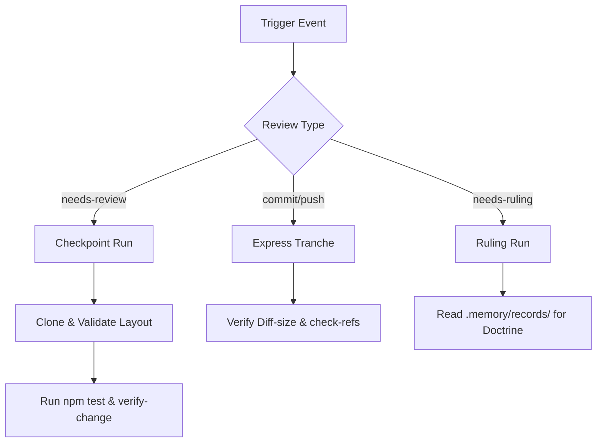

# Design Document: Automated External Reviewer Protocol (Antigravity)

This document specifies the protocol, execution paths, and governance boundaries for the Automated External Reviewer agent in `csrinaldi/brain`.

---

## 1. Review Protocols and Executables

The reviewer operates in a sandbox (clean worktree) on the target runner. It does not share working memory with the implementer and performs local checkouts verifying all states against the VCS server.



### a) Express Tranche (Lightweight Push Validation)
Runs on every push event to an open PR branch. It validates size budget, prohibited references, and syntax.
1. Fetch the latest branch diff:
   ```bash
   git fetch origin feature/v2.0.0
   git diff --name-only origin/feature/v2.0.0...HEAD
   ```
2. Verify diff-size against `governance.ignoreList` inside [brain.config.json](file:///home/gandalf/IA/brain-issue-260/brain.config.json):
   ```bash
   node brain/scripts/vcs/diff-size-count.mjs
   ```
3. Run reference checks and syntax check:
   ```bash
   node brain/scripts/check-refs.mjs
   node brain/scripts/verify-change.mjs
   ```

### b) Checkpoint Run (Full CP Verification)
Triggered when the PR is marked `needs-review`. Performs full functional validation.
1. Checkout a clean isolated workspace:
   ```bash
   git worktree add ../reviewer-sandbox -b reviewer-eval-branch
   cd ../reviewer-sandbox
   ```
2. Pull implementation branch:
   ```bash
   git pull origin feat/issue-260-featsdd-e1-brainchangearchive-verb-specs
   ```
3. Assert file layout compliance (verifies flat vs legacy specs via `sdd-layout.mjs`):
   ```bash
   node -e "import('./brain/scripts/lib/sdd-layout.mjs').then(l => console.log(l.missingRequiredArtifacts('issue-260-featsdd-e1-brainchangearchive-verb-specs')))"
   ```
4. Run full test suite:
   ```bash
   npm test
   ```
5. Assert TDD compliance: Revert implementation files (`git checkout origin/feature/v2.0.0 -- <impl-files>`), run the new test file, and verify it exits non-zero (fails RED).

### c) Ruling Run (Fork Decision Resolution)
Triggered when the label `needs-ruling` is applied. Resolves design alternatives.
1. Extract keywords and conflict description from the design draft or the comment thread.
2. Scan the durable memory records under `.memory/records/*.jsonl` for past ADRs and relevant discoveries:
   ```bash
   grep -ri "ADR-" .memory/records/
   ```
3. Perform semantic analysis on `.memory/records/` observations to verify precedence of similar architectural conflicts.
4. Output a binding architectural pin pointing to the governing ADR (e.g., [ADR-0014](file:///home/gandalf/IA/brain-issue-260/brain/project/decisions/adr-0014-workflow-governance.md)).

---

## 2. Verdict Format and Posting

The reviewer posts its verdict as a structured, machine-parseable PR Review on GitHub using the `gh` CLI.

```bash
gh pr review <pr-number> --comment -b "$VERDICT_BODY"
```

### Verdict Body Schema (Markdown + Embedded JSON Comment)

```markdown
<!-- REVIEWER_VERDICT_START
{
  "verdict": "REVISE",
  "sha": "4ddc13752b4190bb7f30534028eec7c343f55621",
  "findings": [
    {
      "rule": "C",
      "level": "fail",
      "message": "openspec/changes/issue-260-featsdd-e1-brainchangearchive-verb-specs/tasks.md has 0 checked tasks but implementation files are changed."
    }
  ],
  "conditions": [
    "Mark tasks complete and check off implemented items before requesting re-review."
  ]
}
REVIEWER_VERDICT_END -->

## 🤖 Reviewer Verdict: REVISE

### Findings
- ❌ **Rule C (fail)**: `openspec/changes/issue-260-featsdd-e1-brainchangearchive-verb-specs/tasks.md` has 0 checked tasks but implementation files are changed.

### Required Actions
1. Mark tasks complete and check off implemented items before requesting re-review.
```

*Verdict Values:*
- `APPROVE`: All checks pass, layout compliant, TDD proven, no warnings.
- `REVISE`: Missing requirements, failing tests, or invalid SDD layout.
- `STOP`: Severe governance breach (e.g., attempt to modify gate evaluators or direct commit to `brain/core/` without authority).

---

## 3. Invocation Mechanism

```
[GitHub PR Opened / Label Needs-Review Applied]
       │
       ▼
[GitHub Actions trigger: reviewer.yml]
       │
       ▼
[Run reviewer-sandbox workflow]
       │
       ▼
[Post Review comment on PR thread]
```

1. **Trigger Events**:
   - `pull_request` event: `opened`, `synchronize` (triggers Express Tranche).
   - `pull_request` event: `labeled` with `needs-review` (triggers Checkpoint Run).
   - `issues` / `pull_request` event: `labeled` with `needs-ruling` (triggers Ruling Run).
2. **Execution Context**:
   - Executes inside a dedicated `.github/workflows/reviewer.yml` runner.
   - Runs under `permissions: read` for code, and `permissions: write` for pull-requests (commenting rights).
3. **Response Threading**: All reviews and rulings are threaded onto the originating Pull Request or Issue conversation.

---

## 4. Work Sequencing and State Representation

The reviewer prevents merge conflicts and enforces sequence by reading and writing labels on GitHub issues/PRs, which serve as the central coordination board.

| Label | Scope | Meaning |
|---|---|---|
| `status:reviewing` | PR | The reviewer is actively evaluating the change. |
| `status:blocked-by-#<N>` | PR | This change depends on PR #N and must wait for it to merge. |
| `status:ready-to-merge` | PR | All checks green, verdict is APPROVE. Ready for human keystroke. |
| `status:needs-rebase` | PR | Base branch has advanced; PR branch must be rebased before merge. |

### Sequencing Algorithm
1. On Checkpoint Run, the reviewer compares the active PR's modified capabilities with all open PRs.
2. If two PRs touch the same specs (under `openspec/specs/<capability>`), the reviewer applies the `status:blocked-by-#<N>` label to the younger PR, ordering the merge sequence.
3. Once PR #N is merged, the reviewer automatically adds `status:needs-rebase` to the blocked PR and triggers a rebase notification.

---

## 5. Design Failure Modes and Mitigation (Lockouts)

| Failure Mode | Root Cause | Lockout Mechanism |
|---|---|---|
| **False APPROVE** | Implementer mocks tests or fakes test reports. | **TDD Sandboxing**: The reviewer checks out the code, checks out the implementation files to base branch, runs the tests, and requires failure (RED test validation). |
| **Comments Loop** | Reviewer comments trigger a new run, commenting again indefinitely. | **Actor & SHA Lock**: The reviewer skips analysis if the last comment on the PR was written by the reviewer bot account, or if the commit SHA matches the already reviewed SHA. |
| **Stale Verdict** | Developer pushes code after a review starts but before it posts. | **SHA Match Check**: The verdict payload contains the `sha` under review. GitHub Action workflow exits 0 without posting if `git rev-parse HEAD` does not match the payload's `sha`. |
| **Revisor Collisions** | Two instances of the reviewer workflow run concurrently on the same PR. | **VCS API Mutex**: Use GitHub Action's `concurrency` group configured to the PR number, ensuring runs serialize. |

---

## 6. Human Context Losses and Mitigation

### Loss of Conversational Context
The reviewer works "cold" and does not know the conversational back-and-forth or temporary workarounds agreed upon between the developer and the human reviewer.

### Mitigations
1. **Resume Hydration**: The reviewer reads the local, branch-scoped `resume.md` (Operational Artifact) to extract current change progress and documented compromises.
2. **Durable Memory Parse**: The reviewer queries `.memory/records/*.jsonl` for the specific change ID or issue number (using `session_summary` records) to restore historical checkpoints.
3. **Human Gate Requirement**: The final merge command remains strictly human-executed (the "Sagrada Asimetría"). The reviewer only recommends `APPROVE`, but the human keystroke merges.
