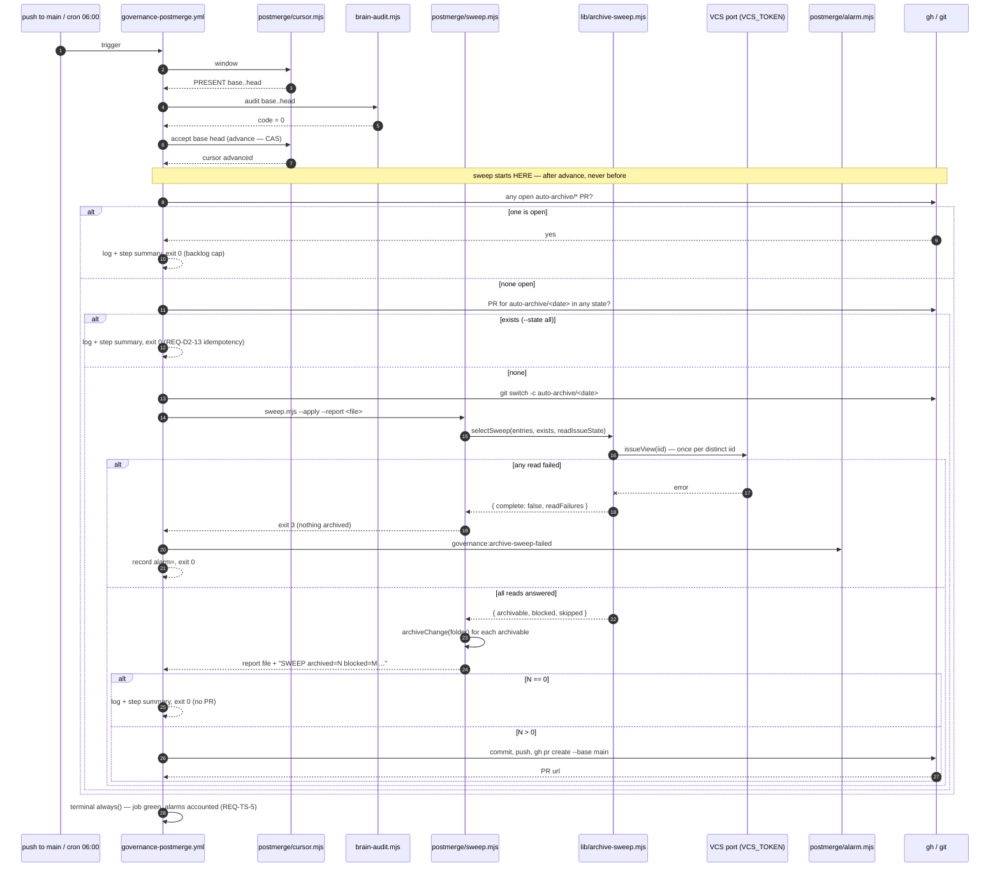

# Design — the sweep is a total function bolted to the one moment main is known good

The archive verb becomes machine-guaranteed by adding **one pure selector**, **one CI-facing
orchestrator**, and **one workflow step that cannot redden the job it runs in**. Nothing about the
audit, the cursor, the parser, or the revert path changes. The selector decides *what* is eligible
and is unit-testable with zero I/O; the orchestrator applies the archive verb and renders a report;
the workflow's bash does the git/gh work, exactly as the revert step already does.

Two blockers found in the current tree that the proposal did not have are resolved here (§D7): the
PR-time `phase-order` gate **fails on every archive PR that consolidates specs**, and **no live
change declares `capability:`**, so today's consolidation path is a silent no-op for 38 of the 46
sweepable folders. Both are fixed or made loud before the backfill ships.

---

## The flow in one picture



---

## Quick path

1. **PR1 — code.** `lib/archive-sweep.mjs` (selector), `postmerge/sweep.mjs` (orchestrator),
   `issueView` widened with `state`/`stateReason`, `archive.mjs` rewired, `phase-order-check.mjs`
   allowlist fix, tests. No folder moves.
2. **PR2 — backfill.** Output of running PR1's `--backfill` locally. Renames + spec appends only.
3. **PR3 — sweep step.** The `governance-postmerge.yml` hunk + workflow drift guards.
4. **PR4 — doctrine.** Two dead references + the human-optional/machine-guaranteed statement.
   Human-authored (see §Delivery).
5. **Verify.** A green post-merge run with nothing eligible opens no PR; with one eligible folder it
   opens exactly one `auto-archive/<date>` PR; a same-day re-run opens none.

---

## D1 — The selector is a new pure module, not a bigger `archive.mjs`

**Decision.** `brain/scripts/lib/archive-sweep.mjs` — pure, zero ambient I/O, every dependency
injected. `archive.mjs` keeps exactly one CLI and delegates selection to it.

**Why not extend `archive.mjs`.** `archive.mjs` is an I/O shell (it builds the `fs` object from
`process.cwd()` at module scope). Putting selection there makes the one thing that must be provably
total — *which folders are eligible* — reachable only through a process spawn. The repo's own
discipline already answers this: `archive-logic.mjs` is pure beside `archive.mjs`, `parse-failures.mjs`
is the one tested parser beside the bash that consumes it, `phase-order-check.mjs` splits
`evaluatePhaseOrder` (pure) from `gatherPhaseOrderInputs` (I/O). The selector is the same split.

**Contract.**

```js
export const OUTCOME = Object.freeze({
  ARCHIVABLE:         'archivable',
  OPEN:               'open',                // issue still open — left in place
  NOT_PLANNED:        'not-planned',         // closed, not archivable
  COLLISION:          'collision',           // >1 live folder shares this iid
  DESTINATION_EXISTS: 'destination-exists',  // archive/<iid> already taken
  NO_ISSUE_KEY:       'no-issue-key',        // grandfathered dir — no issue to read
  UNREADABLE:         'unreadable',          // issue state could not be read
  NOT_A_CHANGE:       'not-a-change',        // does not parse, not grandfathered
  CONTAINER:          'container',           // the archive/ dir itself
});

/**
 * @param {{ entries: string[],
 *           exists: (relPath: string) => boolean,
 *           readIssueState: (iid: string) => Promise<{state, stateReason}|null> }} deps
 * @returns {Promise<{ complete: boolean,
 *                     folders: Array<{ name, iid, outcome, detail }>,
 *                     archivable: string[],
 *                     readFailures: string[] }>}
 */
export async function selectSweep({ entries, exists, readIssueState }) { … }
```

**Classification is a total, ordered decision table — first match wins.** Every input class has a
row; nothing falls through unmapped (the same totality discipline as `evalRung3`'s L1..E9 table).

| # | Condition | Outcome | Network read? |
|---|-----------|---------|---------------|
| 1 | `name === 'archive'` | `container` | no |
| 2 | `!parseChangeId(name) && !isGrandfathered(name)` | `not-a-change` | no |
| 3 | `isGrandfathered(name)` | `no-issue-key` | no |
| 4 | >1 live folder shares this `iid` | `collision` (**all members**) | no |
| 5 | `exists(archivePath(iid))` | `destination-exists` | no |
| 6 | `readIssueState(iid)` returned `null` | `unreadable` | yes |
| 7 | `state` is neither `'open'` nor `'closed'` | `unreadable` | yes |
| 8 | `state === 'open'` | `open` | yes |
| 9 | `stateReason === 'not_planned'` | `not-planned` | yes |
| 10 | otherwise | `archivable` | yes |

Three properties fall out of the ordering and are asserted by test:

- **Local rows precede the network rows.** A collision or a taken destination is decidable from the
  filesystem, so it costs no API call and yields the same answer with or without a token.
- **`unreadable` precedes `open`.** An unanswered read can never be reported as "still open" — that
  is the `evidence-reader-empty-on-failure` class this repo names by hand in `normalizeAssignees`
  and `evalRung3`.
- **Collisions are grouped, not sequential.** `archive.mjs --all` today lets the *first folder in
  `readdirSync` order* win `archive/518` and fails the other two into a `console.error`. Which of
  `issue-518-rung3-residuals`, `issue-518-squash-blindspot-recorded`, `issue-518-widen-audit-walk`
  becomes the durable archive location would be decided by directory-listing order. Blocking **all**
  members of a colliding group is deterministic, order-independent, and leaves the choice with the
  human it belongs to.

**Rejected — re-key `archivePath()` to `<iid>-<slug>`.** Out of scope by the proposal, and it is a
schema migration: `archivePath` is the accessor-owned location (`sdd-layout.mjs:46-49`) and
`phase-order-check.mjs:33` derives `ARCHIVE_DIR_NAME` from it. Changing the key means migrating the
31 existing `archive/<iid>` directories or living with two conventions. A visible skip costs three
folders; a schema change costs the accessor's single-source-of-truth property.

`readIssueState` is memoized per `iid` inside `selectSweep`, so three folders for #518 cost at most
one read (and, per row 4, zero).

---

## D2 — Issue state comes from a widened `issueView`, not from `issueList`

**The gap.** The VCS port cannot answer "is this issue closed". `issueView` returns
`{ number, title, labels, body, author, assignees }` (`github.mjs:83-98`, `gitlab.mjs:97-120`) and
`issueList` returns `{ number, title, labels, assignees }`. Neither carries state.

**Decision.** Widen `issueView` additively:

| Field | Type | GitHub | GitLab |
|-------|------|--------|--------|
| `state` | `'open' \| 'closed'` | `r.state` | `r.state === 'opened' ? 'open' : r.state` |
| `stateReason` | `'completed' \| 'not_planned' \| 'reopened' \| null` | `r.state_reason ?? null` | always `null` |

Same call, no extra round-trip, no new permission (`issues: read` already exists on the PR gate;
post-merge holds `issues: write`). `vcs-contract.md`'s `issueView` row and the contract tests are
updated in the same PR.

**Rejected — `issueList({ state: 'closed' })` and intersect.** One paginated call instead of ~46, but
it destroys both properties the sweep needs. It carries no closure reason, so the not-planned rule
becomes unimplementable; and *absence from the list* is ambiguous between "the issue is open" and
"the read was truncated or failed" — a fail-closed selector cannot be built on a signal that cannot
distinguish those. This is the exact anti-pattern `normalizeAssignees` was written to avoid.

**Rejected — a new `issueState` verb.** A second verb that reads the same endpoint the port already
reads, to return two fields from the payload it already fetched. Widening the existing row is the
smaller contract.

**Documented residual — GitLab cannot express `not_planned`.** GitLab issues have no
`state_reason`, so `stateReason` is always `null` there and row 9 never fires. `null` means *the
provider does not distinguish*, which the selector treats as archivable — deliberately distinct from
`readIssueState` returning `null`, which means *no answer at all* and blocks. On GitLab a
closed-as-abandoned change is archived. Recorded in `vcs-contract.md` as a residual, not silently.

---

## D3 — Fail-closed means the whole run aborts, not one folder skipped

**Decision.** A folder whose issue state cannot be read is classified `unreadable` and is **never**
archived. In addition, if *any* read failed, `selectSweep` returns `complete: false`, and **both
callers refuse to act on the partial set**: the sweep archives nothing and files an alarm; the
backfill archives nothing and exits 1 listing the unreadable iids.

**Why abort rather than continue on the readable subset.** The spec's fail-closed requirement is
that the selector "MUST abort sweep-set computation rather than proceeding as if zero folders were
eligible". A partial run is a quieter version of the same lie: a rate-limited window would produce a
PR that archives 3 folders and says nothing about the 43 it could not evaluate, and the next run
would produce another partial PR. Refusing the run and naming the unreadable iids is the only report
a reader can act on. It also keeps the snapshot coherent: a sweep set computed half under a working
credential and half under a broken one is not a snapshot of anything.

**Authentication.** `VCS_TOKEN: ${{ github.token }}` on the sweep step, mirroring the audit step
(#479). `getVcs()` resolves it through `vcsToken()` and binds it at the port, so every verb the
sweep touches carries it without a per-call argument. Locally the developer's ambient `gh` login
still works (`vcsToken()` answers `null`, `runAsIdentity(null, …)` binds nothing).

**Operational residual — a permanently unreadable issue blocks every sweep.** A deleted or
transferred issue throws on every read, so `complete` is never true and nothing is ever swept. The
port cannot distinguish 404 from 401/429 (`runJson` throws with a message, not a status), and adding
status-code plumbing is a larger contract change than this problem justifies. Mitigations, both
already in the design: the alarm body names the offending iid and folder on every run, and the
single-change path (`npm run brain:change:archive -- <changeId>`) never consults the VCS, so a human
can always unblock by archiving or deleting that one folder by hand.

---

## D4 — `archive.mjs`: one CLI, three modes, no loaded gun

| Mode | Behaviour after this change |
|------|-----------------------------|
| `<changeId>` | **Unchanged.** The explicit human override. Never reads issue state — a human naming one folder has already made the decision the selector exists to make. |
| `--backfill` | Routes through `selectSweep`. Archives only `archivable`. Prints a grouped report of every non-archived folder with its outcome. Exit 1 if `complete === false` **or** any `blocked` outcome occurred; exit 0 only on a clean, fully-classified run. |
| `--all` | Deprecated **alias** of `--backfill`, printing a one-line notice. |

**Why alias `--all` instead of deleting it or keeping it unfiltered.** Keeping unfiltered behaviour
keeps a command in the tree that would archive open #267 and #284 — a loaded gun whose only safety
was a hardcoded `iid === '260'` that is now itself wrong (#260 is closed and must be swept). Deleting
the flag makes an existing invocation fail with "missing changeId", which reads as a bug. An alias
with a notice is loud and safe.

**The `260` hardcode is deleted** (`archive.mjs:44-48`). Protection for an in-flight change now falls
out of row 8 of the decision table — its issue is open. Asserted by a source test: no `'260'` literal
remains, and iid 260 receives the same treatment as any other iid given the same issue state.

**`archiveChange` gains a return value** (additive; `mergeSpecs` untouched):

```js
{ moved: true, consolidated: string[] /* capabilities appended to */, unconsolidated: boolean }
```

The pre-flight in the selector means the `Destination directory … already exists` throw
(`archive-logic.mjs:87-89`) becomes a backstop rather than the mechanism, and no caller relies on
catching it to make progress.

---

## D5 — Sweep placement and failure semantics

**Placement.** A new `- id: sweep` step, positioned as the **last functional step**, after
`- id: uncomputable` and immediately before the `always()` terminal assertion. It is therefore after
`advance` — which is what C1 requires — and it is also after every handler, so even its one exit-1
path cannot skip a step that would otherwise have run. (Placing it directly after `advance` would
also satisfy C1, since `revert`/`uncomputable` are gated on audit codes the sweep never runs under;
last position removes the need to reason about that at all.) Gate:

```yaml
      - id: sweep
        name: Sweep closed changes into the archive (clean audit only)
        if: steps.audit.outputs.code == '0' && steps.advance.outcome == 'success'
```

The second clause is belt-and-braces — a failing `advance` already aborts the job before this step —
but it makes C1 ("only after the cursor advances") readable in the YAML instead of inferable from
step ordering.

**The step never gates anything.** No later step reads `steps.sweep.*` except the terminal
assertion's alarm accounting. `advance` and `revert` are upstream by construction.

**Failure semantics — the step's script is total and exits 0 on every path but one.**

| Situation | What happens | Job |
|-----------|--------------|-----|
| Nothing eligible | log + `$GITHUB_STEP_SUMMARY`, no PR | green |
| Today's PR already exists (`--state all`) | log + summary, no PR | green |
| An `auto-archive/*` PR is open from an earlier day | log + summary, no PR | green |
| Blocked folders (collision / not-planned / no-issue-key) | reported in the PR body and the step summary; **never** an alarm | green |
| Selector read failure, archive error, git/push/PR failure | `alarm.mjs governance:archive-sweep-failed`, `alarm=` recorded, orphan branch deleted | green |
| `alarm.mjs` itself cannot file | `[FAIL] sweep:` on stdout, **exit 1**, no `alarm=` recorded | red → terminal backstop files `governance:postmerge-unreported` |

**Why the sweep must not redden the job — and why that is not "silent".** A red
`governance-postmerge` run is not merely cosmetic: `evalRung3`'s row E6 reads the workflow's run
ledger and reports rung 3 **not armed** whenever the last terminal run did not succeed
(`substrate.mjs:256-265`). A housekeeping bug would therefore demote the reported governance
substrate and train readers to ignore a red post-merge — the precise cost the proposal rates High.
So the step's failure path files a **distinct, non-audit alarm label**
(`governance:archive-sweep-failed`) and exits 0. That satisfies REQ-TS-5 without weakening it: the
invariant forbids *red and silent*, and green-with-a-filed-alarm is not silent — the alarm is an
issue with the run URL in it, filed through the same idempotent-by-label path
(`alarm.mjs:49-68`) every other loud path uses.

**Why not `continue-on-error: true`.** It would achieve the same job-status result in one YAML line,
and it is the wrong line. This workflow already carries a drift guard asserting the audit's exit code
is **not** flattened by `continue-on-error` (`release-postmerge-workflows.test.mjs:417`), because
flattening 1 and 2 was a real defect class here. Adding the attribute to a sibling step invites the
next reader to conclude the precedent is negotiable, and it moves the totality out of the script —
where it is testable by executing the extracted bash — into YAML metadata, where it is not. The
script's own `set +e` / capture / `exit 0` discipline is explicit, and it is the same shape the
`window` step already uses to capture a non-zero code without aborting.

**Terminal-step wiring (REQ-TS-5 accounting).** The `always()` step gains one env entry and one
concatenation term:

```yaml
          ALARM_SWEEP: ${{ steps.sweep.outputs.alarm }}
```
```bash
          filed="${ALARM_WINDOW:-}${ALARM_REVERT:-}${ALARM_UNCOMPUTABLE:-}${ALARM_SWEEP:-}"
```

Without the second edit, a sweep that alarmed and then hit an unrelated red state would be
misreported as red-and-silent. A drift test removes the term and asserts the guard fails.

---

## D6 — Auto-archive PR mechanics

| Concern | Decision |
|---------|----------|
| Branch | `auto-archive/$(date -u +%F)` — UTC, one branch per calendar day |
| Same-day idempotency | `gh pr list --head "$br" --state all` non-empty → skip, no failure. Mirrors REQ-D2-13 verbatim: a PR closed-without-merge today is a human decision, and re-opening it the same day would fight them. Tomorrow's date-keyed branch resumes. |
| Unmerged backlog | **One open `auto-archive/*` PR at a time.** Before anything else: `gh pr list --state open --json headRefName --jq '[.[] \| select(.headRefName \| startswith("auto-archive/"))] \| length'` — non-zero → skip the run. |
| Orphan branch (push succeeded, PR create failed) | `git push origin --delete "$br"` in the failure boundary, then alarm. Same cleanup the revert step performs (`governance-postmerge.yml:317`) so a stale branch can never permanently suppress a retry. |
| Target / label | `--base main`. **No `size:exception`** — see §D8. |
| Body | Rendered by `sweep.mjs` into `$RUNNER_TEMP`: archived folders grouped by capability, the blocked table with reasons, the unconsolidated list, and `Part of #557.` |
| Commit | `chore(openspec): archive <N> closed changes` |

**Why the backlog cap is a correctness requirement, not just tidiness.** Two open sweep PRs both
append to `openspec/specs/<capability>/spec.md`. Whichever merges second conflicts, or worse,
double-appends the same provenance block if the overlap is partial. Serialising to one open PR makes
the append monotone and gives the human review of the consolidated diff — the review the whole
change exists to preserve — a stable base.

**The race (proposal Q3) is answered by convergence, not by locking.** Selection and archiving happen
in the same process on the same checkout, so there is no intra-run race. Between selection and merge:

- *Issue reopened.* The PR archives a folder for a now-open issue. Recovery is a rename back plus
  removing an append — the same operation `git revert` performs. The PR body lists every folder → iid
  pair, so the reviewer can see it before merging.
- *Folder deleted or renamed on main.* The PR conflicts and cannot merge. That is visible, requires a
  human, and tomorrow's run recomputes from the new tree. No handling.

---

## D7 — Two blockers in the current tree the proposal did not have

### D7-a — `phase-order` fails on every archive PR that consolidates specs

An archive PR's diff is: deletions under `openspec/changes/<name>/`, additions under
`openspec/changes/archive/<iid>/`, and modifications to `openspec/specs/<cap>/spec.md`.

`evaluatePhaseOrder` computes `impl` as every changed file that is neither under
`openspec/changes/` nor allowlisted (`phase-order-check.mjs:209`). `isAllowlisted` covers root
`*.md`, `docs/`, and `.memory/` — **not `openspec/specs/`**. So the consolidated spec file counts as
*implementation code*. `touchedDirs` then contains each swept folder (its deletions match the
prefix), and because the folder no longer exists at HEAD, `checkedTasks` is `0` and every artifact
flag is `false`:

- **Rule C** → `fail`: "implementation code present but `tasks.md` has no checked item".
- **Rule A** → `fail`: "implementation without spec.md/design.md".

At brain's `lite` tier `phase-order`'s policy is `detection`, so the job is not in the required
contexts — but it still runs and still goes red on every archive PR, forever, and at
`standard`/`regulated` (`governance-tiers.mjs:151-161`) it is `required` and **blocks the merge**.

**Decision.** Add `openspec/specs/` to `isAllowlisted`. Calling consolidated requirement prose
"implementation code" is a category error: `openspec/specs/**` is the durable SDD artifact, the exact
class `docs/` and `.memory/` are already allowlisted for. Rule C exists to catch code shipped without
phases; it cannot be weakened by exempting a directory that contains no code.

**Rejected — special-case "all files in this dir are deletions".** More faithful to the archive-move
shape, but it adds a diff-status input the pure evaluator does not currently receive
(`changedFiles` is a name list from `git diff --name-only`), and it leaves `openspec/specs/**`
miscategorised for every non-archive PR that edits it.

**Rejected — label the sweep PR with an override.** `phase-order-check.mjs` has no override path, and
inventing one so a bot can bypass a gate is a worse precedent than fixing the classification.

This fix must land in **PR1**, before the backfill: PR2's own diff trips the same failure.

### D7-b — no live change declares `capability:`, so consolidation is a silent no-op

`archiveChange` consolidates a **flat** `spec.md` only when its YAML frontmatter declares
`capability:`; otherwise it emits a `console.warn` and moves the folder anyway
(`archive-logic.mjs:113-123`). Measured in the current tree: **zero** of the 49 flat
`openspec/changes/*/spec.md` files declare `capability:` — several have no frontmatter at all
(`issue-466-474-terminal-states/spec.md:1`). Only the 8 folders using the nested
`specs/<cap>/spec.md` convention consolidate.

So the proposal's "~50 changes' spec deltas never reached `openspec/specs/`" is true, and running the
backfill **does not fix it**: ~38 folders would move with their delta unconsolidated, behind a
warning buried in a loop.

**Decision — archive anyway, and make the split a first-class reported outcome.** `archiveChange`
returns `unconsolidated: true` instead of only warning; the backfill and sweep reports state three
counts, and the PR body carries them:

```
archived: 46  (consolidated: 8 · carried unconsolidated: 38)
blocked:   5
```

**Why not block unconsolidated folders.** Blocking would sweep 8 of 46 and leave the directory still
96% dead — the change would not achieve its purpose. And leaving a folder in `changes/` does not get
its requirements into `specs/` either; it only keeps the directory lying about what is in flight. The
delta is not lost: it travels verbatim into `openspec/changes/archive/<iid>/spec.md`, versioned and
greppable.

**Why not infer the capability.** From the change slug, it would mint ~38 single-change capability
directories under `openspec/specs/` — the opposite of "consolidated live requirements".

**Follow-up, explicitly not in this change:** declare `capability:` in the `/sdd-spec` scaffold and
backfill declarations across existing changes. That touches the harness scaffold and 49 files, and
the proposal already fences "retro-fixing spec deltas" out of scope. It should be filed as its own
issue when this one merges.

**Consequence for review load:** the backfill PR's `openspec/specs/**` diff is far smaller than the
proposal assumed — appends from at most 8 folders, across ~6 capabilities.

### D7-c — Rule B is a no-op for archived folders (correcting the proposal's stated reason)

The proposal says "`phase-order-check.mjs` already models `archived` as a forward rung, so Rule B
holds". The conclusion is right, the reason is not. `archiveChange` never writes a status; after the
move, `tasks.md` does not exist at HEAD, so `statusAfter` is `undefined` and `evaluateRuleB`
short-circuits (`phase-order-check.mjs:161`). The `'archived'` rung matters only for a human who
stamps it *before* archiving.

**Decision — do not stamp `status: archived` during archiving.** The stamped file would live under
`openspec/changes/archive/**`, which the checker excludes by construction
(`phase-order-check.mjs:33, 213`), so nothing would ever read it. And it would turn a pure rename
into a content edit, breaking the "archive is a rename plus an append" property the rollback plan
depends on.

---

## D8 — Backfill delivery: one PR, no `size:exception`, and this is measured

`diffSize` counts `git diff --numstat` **minus `governance.ignoreList`**
(`governance/checks/diff-size.mjs:15-16`). `brain.config.json:23-25` already ignores
`openspec/changes/**`, `openspec/specs/**`, and `openspec/changes/archive/**`. The backfill and every
future sweep PR touch nothing else. **Measured diff size: 0 lines. No `size:exception`, ever —
neither for the backfill nor for the daily sweep PR** (unlike the auto-revert PR, which hardcodes the
label).

That settles the gate question. The remaining question is human review load, and after D7-b it is
small: ~46 renames plus appends from ~8 folders.

**Decision — one PR for the backfill, split by deliverable, not by capability.**

| PR | Content | Why separate |
|----|---------|--------------|
| 1 | Selector, `sweep.mjs`, `issueView` widening, `archive.mjs` rewire, `phase-order` allowlist, tests | Reviewable logic. Must precede 2 (the backfill's own diff trips D7-a) and 3 (the workflow calls it). |
| 2 | The backfill's output only — no code | "Review the consolidated spec diff, not the folder renames" is only possible when the PR contains nothing else |
| 3 | The `governance-postmerge.yml` hunk + workflow drift guards | Independently revertible; the proposal's stated first response to sweep misbehaviour |
| 4 | Doctrine fixes | Touches `brain/core/**` → Tier-2. `brain-writes-reviewed.mjs:131-139` **fails at every tier** for an agent-authored `brain/core` change, so this PR must be human-authored. |

**Rejected — split the backfill by capability.** `archiveChange` is atomic per folder (move and
append together). Splitting by capability means either de-atomising the verb or running it in N
passes with N interleaved reviews — multiplying reviewer context for zero added safety on a change
that deletes nothing and reverts with one command.

**Rejected — ship the sweep step first and let the machine produce the backfill.** Tempting (it
dogfoods the step and deletes a manual task), and wrong as a first run: the largest archive PR this
repo will ever see would be generated by a step with zero prior evidence that it works, and reviewed
under machine authorship. The backfill goes first, human-reviewed; the sweep then only ever handles
the steady-state trickle.

**Not-planned folders in the backfill.** Same rule as the sweep — skipped, listed in the PR body
under "closed, not archivable", left in `changes/`. A human who decides an abandoned change should be
archived uses the explicit single-change path, which is an act with a name on it.

---

## D9 — Doctrine: exact target wording

**`openspec/README.md:5`** — the current target (`../brain/decisions/adr-0002-harness-reemplazable-openspec.md`)
is dead twice over: `brain/decisions/` does not exist, and ADR-0002 is now
`adr-0002-memoria-git-based-dos-capas.md`. Replace with:

```markdown
> See [`../brain/project/decisions/adr-0001-arquitectura-3-capas-harness-reemplazable.md`](../brain/project/decisions/adr-0001-arquitectura-3-capas-harness-reemplazable.md).
```

ADR-0001 is the right target: it is the decision that makes `openspec/` the durable contract and the
harness replaceable — exactly what the sentence claims.

**`openspec/README.md` — new rule 5**, so the directory's own README stops asserting something false:

```markdown
5. **Archived automatically.** A change whose issue is CLOSED is swept out of `changes/` into
   `changes/archive/<iid>/` by the post-merge governance workflow, which opens one
   `auto-archive/<date>` PR after a clean audit. `changes/` therefore lists in-flight work only.
```

**`brain/core/methodology/harness-contract.md:6`** — "Referenced by ADR-0002" is wrong for the same
reason. ADR-0005 is the ADR that *owns* this file ("Verb contract:
`brain/core/methodology/harness-contract.md`", `adr-0005:16`); ADR-0001 is the layering context.
Name both, with resolvable links:

```markdown
> to be compatible with this project. Referenced by
> [ADR-0005](../../project/decisions/adr-0005-adapter-harness-sdd-harness.md) (harness adapter) and
> [ADR-0001](../../project/decisions/adr-0001-arquitectura-3-capas-harness-reemplazable.md)
> (3-layer architecture).
```

**`harness-contract.md:43-50` — `/sdd-archive` stays in "Optional verbs (recommended)"**, with a
callout immediately after the table:

```markdown
> **`/sdd-archive` is human-optional, machine-guaranteed.** No human is required to run it, and no
> gate fails because a change is unarchived — staleness is never an audit failure class. Archiving
> itself is guaranteed by the machine: after every clean post-merge audit,
> `.github/workflows/governance-postmerge.yml` sweeps changes whose issue is CLOSED into
> `openspec/changes/archive/` via one `auto-archive/<date>` PR. "Optional" here means "not your
> job", not "nobody's job" — running it by hand only makes the next sweep a no-op.
```

**Why the row does not move to a new category.** Moving `/sdd-archive` out of "Optional verbs" is the
first step toward reading it as required, which contradicts the ruling and C2. The problem was never
the table's placement — it was that "optional" carried no statement about who *does* archive. The
callout supplies exactly that, names the mechanism and the file so a reader can verify it, and leaves
the verb taxonomy alone.

---

## Module contracts

| File | Kind | Responsibility |
|------|------|----------------|
| `brain/scripts/lib/archive-sweep.mjs` | **new**, pure | `selectSweep`, `groupByIid`, `OUTCOME`. Zero ambient I/O; `exists` and `readIssueState` injected. |
| `brain/scripts/lib/archive-logic.mjs` | modified | `archiveChange` returns `{ moved, consolidated, unconsolidated }`. `mergeSpecs`, `parseYamlFrontmatter` untouched. |
| `brain/scripts/archive.mjs` | modified | `--backfill` on the selector; `--all` aliased; `260` deleted; grouped report; exit discipline per §D4. |
| `brain/scripts/governance/postmerge/sweep.mjs` | **new**, I/O | Real `readIssueState` (via `getVcs().issueView`), applies `archiveChange`, renders the markdown report, prints `SWEEP archived=N blocked=M unconsolidated=K`. Exit 0 clean / 3 incomplete-or-failed. No git, no gh. |
| `brain/scripts/vcs/providers/{github,gitlab}.mjs` | modified | `issueView` returns `state` + `stateReason`. |
| `brain/core/methodology/vcs-contract.md` | modified | `issueView` row + the GitLab `stateReason` residual. |
| `brain/scripts/vcs/phase-order-check.mjs` | modified | `isAllowlisted` accepts `openspec/specs/`. |
| `.github/workflows/governance-postmerge.yml` | modified | `- id: sweep` after `advance`; `ALARM_SWEEP` in the terminal step. |

**The node/bash boundary is the one this workflow already draws.** `sweep.mjs` computes and renders;
the step's bash does git and gh, exactly as the revert step does and as `alarm.mjs` does for issues.
Credential handling and branch policy stay in one place instead of being split across two languages.

---

## Testing

**Unit — `brain/scripts/lib/archive-sweep.test.mjs` (`node --test`, fakes only, no network, no cwd):**

| # | Case | Assertion |
|---|------|-----------|
| 1 | closed + `completed` | `archivable` |
| 2 | open | `open`, absent from `archivable` |
| 3 | closed + `not_planned` | `not-planned`, absent from `archivable` |
| 4 | `stateReason: null` (GitLab shape) | `archivable` — distinct from case 5 |
| 5 | `readIssueState` → `null` | `unreadable`, `complete === false`, `archivable` empty |
| 6 | unrecognised `state` value | `unreadable`, never `open` |
| 7 | 3 folders share iid 518 | all three `collision`; **assert with the entry list reversed** — same answer |
| 8 | `archive/<iid>` exists | `destination-exists` |
| 9 | `archive/` container + non-change dir | `container` / `not-a-change`, and the `readIssueState` spy recorded **zero** calls for them |
| 10 | iid `260` | identical treatment to any other iid at the same state (teeth against a re-introduced hardcode) |
| 11 | 3 folders, 1 iid, no collision path | `readIssueState` called at most once per distinct iid |

**Unit — `archive-logic.test.mjs` (extend):** `archiveChange` reports `unconsolidated: true` for a
flat `spec.md` without `capability:`; `consolidated: ['<cap>']` for the nested convention; still
throws on an existing destination (backstop).

**Unit — `postmerge/sweep.test.mjs`:** report rendering is deterministic and lists every blocked
folder with its reason; the summary line's counts match the classification; exit 3 when
`complete === false` and nothing was moved.

**Regression — `phase-order-check.test.mjs`:** the archive-PR diff shape
(`openspec/changes/X/*` deleted + `openspec/changes/archive/N/*` added +
`openspec/specs/cap/spec.md` modified) evaluates `pass`. Teeth: removing the allowlist entry restores
the Rule C/Rule A failures.

**Contract — `vcs.contract.test.mjs` + provider fixtures:** both providers return `state` and
`stateReason`; GitLab's `opened` normalises to `open` and its `stateReason` is always `null`.

**Workflow — `brain/scripts/vcs/release-postmerge-workflows.test.mjs` (extend).** The hunk *is*
testable; this file already extracts `run: |` blocks and executes them under isolated environments
with fake `gh`. Source-level guards:

- a step `- id: sweep` exists, and its line index is **greater** than `- id: advance`'s;
- its `if:` names `steps.audit.outputs.code == '0'` and references neither `steps.revert` nor
  `steps.uncomputable`;
- its script contains no `cursor.mjs` (the sweep never writes the cursor);
- it declares `VCS_TOKEN` (the #479 drift guard already asserts this shape for audit steps);
- it dedups on the PR head with `--state all`, mirroring the existing REQ-D2-13 test;
- the terminal step's env carries `ALARM_SWEEP` **and** `filed=` includes `${ALARM_SWEEP:-}` — teeth:
  deleting either term fails the guard;
- no `continue-on-error` is introduced.

Executable guards, using the file's isolated-bash harness with fake `gh`/`node`:

- selector reports zero archivable → **no** `pr create`, exit 0;
- selector exits non-zero → an alarm was filed with label `governance:archive-sweep-failed`,
  `alarm=` was written to the output file, exit 0;
- an `auto-archive/*` PR is already open → no `pr create`, exit 0;
- `push` fails → the orphan branch delete is attempted, an alarm is filed, exit 0.

---

## Risks and residuals

| Risk | Handling |
|------|----------|
| A permanently unreadable issue blocks all sweeping | Named in the alarm every run; human unblocks via the single-change CLI (§D3) |
| Sweep archives a folder whose merge is later reverted | C1 (clean audit, post-advance) narrows it; recovery is a rename back plus removing an append |
| Multi-folder issues (#518 ×3, #266 ×2) are never swept | Deliberate. Reported every run in the PR body; resolution is a human decision or a separate re-keying change |
| 38 folders archive without consolidating their spec delta | Reported as a distinct count, not a buried warning; follow-up issue for `capability:` in the scaffold (§D7-b) |
| `openspec/specs/` allowlisting weakens Rule C | It exempts a directory that contains no code; Rule C's purpose (code without phases) is untouched |
| An abandoned open `auto-archive` PR stops all sweeping | By design (§D6). Visible as an open PR; closing it resumes the next run |
| A runner kill (OOM/timeout) inside the sweep step | The only path where the sweep reddens the job. The terminal backstop files `governance:postmerge-unreported`; the cursor advance already happened |

---

## Checklist

- [ ] `selectSweep` is total: every input class maps to exactly one `OUTCOME` row
- [ ] No archive decision is made from a read that did not answer
- [ ] No `'260'` literal remains in `archive.mjs`
- [ ] Collisions are order-independent and block every member of the group
- [ ] The sweep step sits after `advance` and is read by no later step but the alarm accounting
- [ ] `ALARM_SWEEP` is both declared and concatenated into `filed`
- [ ] An archive-shaped diff passes `phase-order-check`
- [ ] The backfill PR contains no code
- [ ] The doctrine PR is human-authored

## Next step

`/sdd-tasks` — break PR1..PR4 into the task list, carrying the four-PR chain, the
"PR1 before PR2" ordering constraint (§D7-a), and the human-authorship constraint on PR4.
